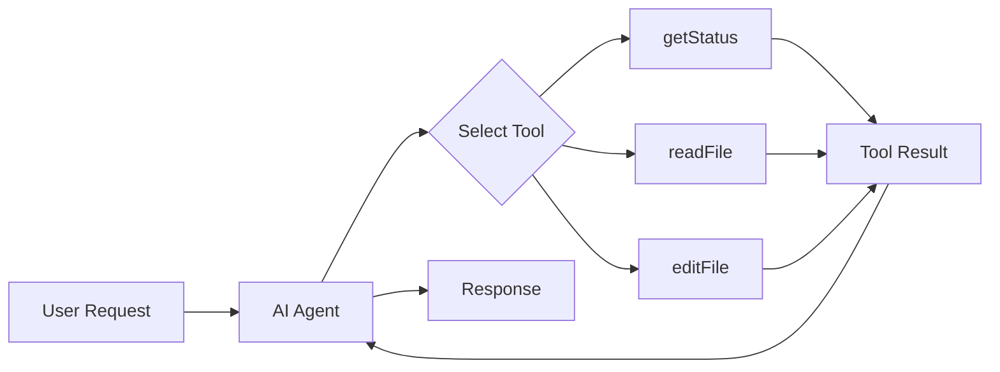

wit's AI capabilities are built on a comprehensive set of tools that agents use to interact with repositories, understand code, and perform operations. This document provides a complete reference for developers who want to understand, use, or extend the tool system.

## Overview

Tools are the building blocks that give AI agents their capabilities. Each tool is a discrete operation with:
- **Input Schema**: Validated parameters using Zod
- **Output Schema**: Typed return values
- **Execute Function**: The implementation logic

### Tool Categories

| Category | Count | Purpose |
|----------|-------|---------|
| [Git Operations](#git-operations-tools) | 10 | Repository state and history |
| [File System](#file-system-tools) | 5 | Read, write, edit files |
| [AI Generation](#ai-generation-tools) | 4 | PR descriptions, reviews, release notes |
| [Search](#search-tools) | 3 | Pattern and semantic search |
| [Virtual Filesystem](#virtual-filesystem-tools) | 6 | In-memory operations for IDE/server |

### How Tools are Used



Agents autonomously decide which tools to use based on the task. For example, when asked to "fix the bug in auth.ts", the Code Agent might:

1. `getStatus` - Check repository state
2. `readFile` - Read auth.ts to understand the code
3. `editFile` - Make the fix
4. `runCommand` - Run tests to verify
5. `stageFiles` - Stage the change
6. `createCommit` - Commit with a descriptive message

---

## Git Operations Tools

These tools provide access to Git functionality for reading repository state, making changes, and managing branches.

### getStatus

Get the current status of the repository including staged, modified, and untracked files.

<ParamField path="path" type="string" optional>
  Path to the repository. Defaults to current directory.
</ParamField>

**Returns:**

| Field | Type | Description |
|-------|------|-------------|
| `branch` | `string \| null` | Current branch name |
| `staged` | `string[]` | Files staged for commit |
| `modified` | `string[]` | Modified but not staged |
| `untracked` | `string[]` | New untracked files |
| `deleted` | `string[]` | Deleted files |
| `hasChanges` | `boolean` | Whether any changes exist |
| `isClean` | `boolean` | Whether working tree is clean |

**Example:**

```typescript
const result = await tools.getStatus.execute({});
// {
//   branch: "feature/auth",
//   staged: ["src/auth.ts"],
//   modified: ["src/utils.ts"],
//   untracked: ["src/new-file.ts"],
//   deleted: [],
//   hasChanges: true,
//   isClean: false
// }
```

### getDiff

Get the diff showing what has changed in the repository.

<ParamField path="staged" type="boolean" optional default={false}>
  If true, show only staged changes.
</ParamField>

<ParamField path="files" type="string[]" optional>
  Specific files to show diff for. If not specified, shows all.
</ParamField>

<ParamField path="contextLines" type="number" optional default={3}>
  Number of context lines around changes.
</ParamField>

**Returns:**

| Field | Type | Description |
|-------|------|-------------|
| `diffs` | `Array` | Per-file diff information |
| `diffs[].file` | `string` | File path |
| `diffs[].additions` | `number` | Lines added |
| `diffs[].deletions` | `number` | Lines removed |
| `diffs[].content` | `string` | Unified diff content |
| `totalAdditions` | `number` | Total lines added |
| `totalDeletions` | `number` | Total lines removed |
| `filesChanged` | `number` | Number of files changed |
| `summary` | `string` | Human-readable summary |

**Example:**

```typescript
const result = await tools.getDiff.execute({ staged: true });
// {
//   diffs: [{
//     file: "src/auth.ts",
//     additions: 5,
//     deletions: 2,
//     content: "--- a/src/auth.ts\n+++ b/src/auth.ts\n@@ -10,7 +10,10 @@..."
//   }],
//   totalAdditions: 5,
//   totalDeletions: 2,
//   filesChanged: 1,
//   summary: "1 file(s) changed, 5 insertion(s), 2 deletion(s)"
// }
```

### stageFiles

Stage files for the next commit.

<ParamField path="files" type="string[]" required>
  Array of file paths to stage. Use `["."]` to stage all files.
</ParamField>

**Returns:**

| Field | Type | Description |
|-------|------|-------------|
| `success` | `boolean` | Whether staging succeeded |
| `stagedFiles` | `string[]` | Files that were staged |
| `message` | `string` | Status message |

**Example:**

```typescript
// Stage specific files
await tools.stageFiles.execute({ files: ["src/auth.ts", "src/utils.ts"] });

// Stage all files
await tools.stageFiles.execute({ files: ["."] });
```

### createCommit

Create a new commit with staged changes.

<ParamField path="message" type="string" required>
  The commit message describing the changes.
</ParamField>

<ParamField path="all" type="boolean" optional default={false}>
  Stage all tracked modified files before committing (like `git commit -a`).
</ParamField>

**Returns:**

| Field | Type | Description |
|-------|------|-------------|
| `success` | `boolean` | Whether commit succeeded |
| `hash` | `string` | Full commit hash |
| `shortHash` | `string` | Short (8 char) hash |
| `branch` | `string \| null` | Branch name |
| `message` | `string` | Status message |
| `filesCommitted` | `number` | Number of files in commit |

**Example:**

```typescript
const result = await tools.createCommit.execute({
  message: "feat(auth): add token refresh logic",
  all: true
});
// {
//   success: true,
//   hash: "abc123def456789...",
//   shortHash: "abc123de",
//   branch: "feature/auth",
//   message: "[feature/auth abc123de] feat(auth): add token refresh logic",
//   filesCommitted: 2
// }
```

### getLog

Get the commit history.

<ParamField path="limit" type="number" optional default={10}>
  Maximum number of commits to return.
</ParamField>

<ParamField path="ref" type="string" optional default="HEAD">
  Starting reference (branch, tag, or commit hash).
</ParamField>

**Returns:**

| Field | Type | Description |
|-------|------|-------------|
| `commits` | `Array` | Array of commit objects |
| `commits[].hash` | `string` | Full commit hash |
| `commits[].shortHash` | `string` | Short hash |
| `commits[].message` | `string` | Full message |
| `commits[].subject` | `string` | First line of message |
| `commits[].author` | `string` | Author name |
| `commits[].email` | `string` | Author email |
| `commits[].date` | `string` | ISO date string |
| `commits[].timestamp` | `number` | Unix timestamp |
| `totalShown` | `number` | Number of commits returned |

### getBranches

List all branches in the repository.

**Input:** None required

**Returns:**

| Field | Type | Description |
|-------|------|-------------|
| `current` | `string \| null` | Current branch name |
| `branches` | `Array` | List of branches |
| `branches[].name` | `string` | Branch name |
| `branches[].isCurrent` | `boolean` | Is this the current branch |
| `branches[].hash` | `string` | Commit hash branch points to |
| `totalBranches` | `number` | Total branch count |

### switchBranch

Switch to a different branch.

<ParamField path="branch" type="string" required>
  Name of the branch to switch to.
</ParamField>

<ParamField path="create" type="boolean" optional default={false}>
  Create the branch if it doesn't exist.
</ParamField>

**Returns:**

| Field | Type | Description |
|-------|------|-------------|
| `success` | `boolean` | Whether switch succeeded |
| `previousBranch` | `string \| null` | Branch we switched from |
| `currentBranch` | `string` | Branch we switched to |
| `message` | `string` | Status message |
| `wasCreated` | `boolean` | Whether branch was newly created |
| `workSaved` | `boolean` | Whether uncommitted work was auto-saved |

<Note>
wit automatically saves uncommitted work when switching branches (auto-stash).
</Note>

### getMergeConflicts

Get information about current merge conflicts.

**Input:** None required

**Returns:**

| Field | Type | Description |
|-------|------|-------------|
| `inProgress` | `boolean` | Whether merge is in progress |
| `sourceBranch` | `string` | Branch being merged |
| `targetBranch` | `string` | Branch being merged into |
| `conflicts` | `Array` | Conflicting files with regions |
| `conflicts[].file` | `string` | File path |
| `conflicts[].regions` | `Array` | Conflict regions |
| `conflicts[].oursContent` | `string` | Our version |
| `conflicts[].theirsContent` | `string` | Their version |
| `resolved` | `string[]` | Already resolved files |
| `unresolved` | `number` | Count of unresolved conflicts |

### resolveConflict

Resolve a merge conflict by providing resolved content.

<ParamField path="file" type="string" required>
  Path to the conflicted file.
</ParamField>

<ParamField path="content" type="string" required>
  The resolved content to write.
</ParamField>

<ParamField path="markResolved" type="boolean" optional default={true}>
  Whether to mark the file as resolved.
</ParamField>

**Returns:**

| Field | Type | Description |
|-------|------|-------------|
| `success` | `boolean` | Whether resolution succeeded |
| `message` | `string` | Status message |
| `remainingConflicts` | `number` | Conflicts still to resolve |
| `canComplete` | `boolean` | Whether merge can be completed |

### undo

Undo the last operation(s) using wit's journal.

<ParamField path="steps" type="number" optional default={1}>
  Number of operations to undo.
</ParamField>

<ParamField path="dryRun" type="boolean" optional default={false}>
  Preview what would be undone without actually undoing.
</ParamField>

**Returns:**

| Field | Type | Description |
|-------|------|-------------|
| `success` | `boolean` | Whether undo succeeded |
| `undone` | `Array` | Operations that were undone |
| `undone[].operation` | `string` | Operation type |
| `undone[].description` | `string` | What was done |
| `undone[].timestamp` | `number` | When it was done |
| `message` | `string` | Status message |

<Note>
wit maintains a journal of all operations, making undo actually reliable unlike `git reflog`.
</Note>

---

## File System Tools

These tools allow agents to read, write, and navigate the repository file system.

### readFile

Read the contents of a file from the repository.

<ParamField path="filePath" type="string" required>
  Path to the file relative to repository root.
</ParamField>

<ParamField path="startLine" type="number" optional>
  Start reading from this line (1-indexed).
</ParamField>

<ParamField path="endLine" type="number" optional>
  Stop reading at this line (inclusive).
</ParamField>

**Returns:**

| Field | Type | Description |
|-------|------|-------------|
| `success` | `boolean` | Whether read succeeded |
| `content` | `string` | File content (or base64 for binary) |
| `isBinary` | `boolean` | Whether file is binary |
| `lineCount` | `number` | Total lines in file |
| `startLine` | `number` | Actual start line returned |
| `endLine` | `number` | Actual end line returned |
| `size` | `number` | File size in bytes |
| `errorMessage` | `string` | Error message if failed |

**Example:**

```typescript
// Read entire file
const result = await tools.readFile.execute({ filePath: "src/auth.ts" });

// Read specific lines (useful for large files)
const result = await tools.readFile.execute({
  filePath: "src/auth.ts",
  startLine: 50,
  endLine: 100
});
```

<Warning>
Always read a file before editing it. Agents are instructed to follow this pattern.
</Warning>

### writeFile

Create a new file or overwrite an existing file.

<ParamField path="filePath" type="string" required>
  Path to the file relative to repository root.
</ParamField>

<ParamField path="content" type="string" required>
  Content to write to the file.
</ParamField>

<ParamField path="createDirectories" type="boolean" optional default={true}>
  Create parent directories if they don't exist.
</ParamField>

**Returns:**

| Field | Type | Description |
|-------|------|-------------|
| `success` | `boolean` | Whether write succeeded |
| `filePath` | `string` | Path where file was written |
| `created` | `boolean` | Whether this was a new file |
| `size` | `number` | Size of written file in bytes |
| `message` | `string` | Status message |
| `previousContent` | `string` | Previous content (for undo) |

**Security:**
- Cannot write to `.wit` or `.git` directories
- Cannot write outside the repository

### editFile

Make targeted edits to existing files using search and replace.

<ParamField path="filePath" type="string" required>
  Path to the file relative to repository root.
</ParamField>

<ParamField path="edits" type="Array" required>
  Array of edit operations to apply in order.
</ParamField>

<ParamField path="edits[].oldText" type="string" required>
  The exact text to find (must match exactly including whitespace).
</ParamField>

<ParamField path="edits[].newText" type="string" required>
  The text to replace it with.
</ParamField>

<ParamField path="dryRun" type="boolean" optional default={false}>
  Validate edits without applying them.
</ParamField>

**Returns:**

| Field | Type | Description |
|-------|------|-------------|
| `success` | `boolean` | Whether all edits succeeded |
| `filePath` | `string` | File that was edited |
| `editsApplied` | `number` | Number of successful edits |
| `editResults` | `Array` | Per-edit results |
| `editResults[].index` | `number` | Edit index |
| `editResults[].applied` | `boolean` | Whether edit was applied |
| `editResults[].errorMessage` | `string` | Error if failed |
| `message` | `string` | Status message |
| `diff` | `string` | Preview of changes |

**Example:**

```typescript
const result = await tools.editFile.execute({
  filePath: "src/auth.ts",
  edits: [
    {
      oldText: "const token = getToken();",
      newText: "const token = await getToken();"
    },
    {
      oldText: "function validateUser(user) {",
      newText: "async function validateUser(user) {"
    }
  ],
  dryRun: true  // Preview first
});
```

<Tip>
**Best Practices:**
- Include enough context in `oldText` to uniquely identify the location
- Preserve exact whitespace and indentation
- Use `dryRun: true` first if unsure
- Make one logical change per edit when possible
</Tip>

### listDirectory

List files and directories in the repository.

<ParamField path="dirPath" type="string" optional default=".">
  Directory path relative to repository root.
</ParamField>

<ParamField path="recursive" type="boolean" optional default={false}>
  List subdirectories recursively.
</ParamField>

<ParamField path="maxDepth" type="number" optional default={3}>
  Maximum depth for recursive listing (1-10).
</ParamField>

<ParamField path="includeHidden" type="boolean" optional default={false}>
  Include hidden files (starting with .).
</ParamField>

<ParamField path="pattern" type="string" optional>
  Filter by glob pattern (e.g., `*.ts`, `src/**/*.js`).
</ParamField>

**Returns:**

| Field | Type | Description |
|-------|------|-------------|
| `success` | `boolean` | Whether listing succeeded |
| `path` | `string` | Directory that was listed |
| `entries` | `Array` | Directory entries |
| `entries[].name` | `string` | File/directory name |
| `entries[].path` | `string` | Relative path |
| `entries[].type` | `'file' \| 'directory'` | Entry type |
| `entries[].size` | `number` | File size (for files) |
| `totalFiles` | `number` | Total file count |
| `totalDirectories` | `number` | Total directory count |
| `truncated` | `boolean` | Whether results were truncated |

### runCommand

Execute shell commands with safety restrictions.

<ParamField path="command" type="string" required>
  The command to execute.
</ParamField>

<ParamField path="args" type="string[]" optional>
  Command arguments as separate array items.
</ParamField>

<ParamField path="timeout" type="number" optional default={60000}>
  Timeout in milliseconds (max 120000).
</ParamField>

<ParamField path="env" type="Record<string, string>" optional>
  Additional environment variables.
</ParamField>

**Returns:**

| Field | Type | Description |
|-------|------|-------------|
| `success` | `boolean` | Whether command succeeded |
| `exitCode` | `number` | Process exit code |
| `stdout` | `string` | Standard output |
| `stderr` | `string` | Standard error |
| `errorMessage` | `string` | Error message if failed |
| `timedOut` | `boolean` | Whether command timed out |
| `truncated` | `boolean` | Whether output was truncated |
| `duration` | `number` | Execution time in ms |
| `sandbox` | `boolean` | Whether ran in sandbox |

**Allowed Commands:**

```typescript
// Package managers
'npm', 'npx', 'yarn', 'pnpm', 'bun'

// Build tools
'node', 'tsc', 'tsx', 'vite', 'webpack', 'esbuild', 'rollup'

// Testing
'jest', 'vitest', 'mocha', 'pytest', 'cargo'

// Linting
'eslint', 'prettier', 'biome', 'rustfmt', 'black', 'ruff'

// Languages
'python', 'python3', 'ruby', 'go', 'rustc'

// Utilities
'cat', 'ls', 'pwd', 'echo', 'head', 'tail', 'grep', 'find', 'wc', 'make', 'cmake'
```

**Blocked Commands:**
```typescript
'rm', 'rmdir', 'sudo', 'su', 'curl', 'wget', 'ssh', 'chmod', 'kill', 'eval'
// ...and other dangerous commands
```

<Note>
When sandbox is configured (E2B, Daytona, Docker, or Vercel), commands run in an isolated environment with fewer restrictions.
</Note>

---

## AI Generation Tools

These tools use AI to generate content like PR descriptions, code reviews, and release notes.

### generatePRDescription

Generate a pull request description from diff and commits.

<ParamField path="diff" type="string" required>
  The diff content showing code changes.
</ParamField>

<ParamField path="commits" type="Array" required>
  Commits included in the PR.
</ParamField>

<ParamField path="commits[].message" type="string" required>
  Commit message.
</ParamField>

<ParamField path="commits[].sha" type="string" required>
  Commit SHA.
</ParamField>

<ParamField path="title" type="string" optional>
  Optional title (generated if not provided).
</ParamField>

<ParamField path="existingDescription" type="string" optional>
  Existing description to enhance.
</ParamField>

**Returns:**

| Field | Type | Description |
|-------|------|-------------|
| `title` | `string` | PR title |
| `description` | `string` | Full markdown description |
| `labels` | `string[]` | Suggested labels |
| `summary` | `string` | Brief summary |
| `changes` | `string[]` | List of changes |
| `testPlan` | `string` | Suggested test plan |
| `breakingChanges` | `string[]` | Breaking changes if any |

### reviewPR

Perform an AI-powered code review.

<ParamField path="diff" type="string" required>
  The diff content to review.
</ParamField>

<ParamField path="files" type="Array" optional>
  Full file contents for deeper analysis.
</ParamField>

<ParamField path="context" type="object" optional>
  Additional context for the review.
</ParamField>

<ParamField path="context.repoDescription" type="string" optional>
  Description of the repository.
</ParamField>

<ParamField path="context.styleguide" type="string" optional>
  Style guide to follow.
</ParamField>

**Returns:**

| Field | Type | Description |
|-------|------|-------------|
| `summary` | `string` | Review summary |
| `issues` | `Array` | Found issues |
| `issues[].severity` | `'info' \| 'warning' \| 'error'` | Issue severity |
| `issues[].file` | `string` | File path |
| `issues[].line` | `number` | Line number |
| `issues[].message` | `string` | Issue description |
| `issues[].suggestion` | `string` | Suggested fix |
| `suggestions` | `string[]` | General suggestions |
| `securityConcerns` | `string[]` | Security issues |
| `overallScore` | `number` | Score 1-10 |
| `approved` | `boolean` | Whether to approve |

**Checks Performed:**
- SQL injection vulnerabilities
- Hardcoded secrets
- XSS risks
- Empty catch blocks
- Console.log statements
- Performance issues
- Code style

### generateReleaseNotes

Generate release notes from commits between versions.

<ParamField path="version" type="string" required>
  The version being released (e.g., "v1.2.0").
</ParamField>

<ParamField path="previousVersion" type="string" optional>
  Previous version to compare against.
</ParamField>

<ParamField path="commits" type="Array" required>
  Commits included in this release.
</ParamField>

<ParamField path="style" type="'standard' | 'detailed' | 'minimal' | 'changelog'" optional default="standard">
  Output style.
</ParamField>

**Returns:**

| Field | Type | Description |
|-------|------|-------------|
| `version` | `string` | Release version |
| `title` | `string` | Release title |
| `body` | `string` | Full markdown body |
| `categories.breaking` | `Array` | Breaking changes |
| `categories.features` | `Array` | New features |
| `categories.fixes` | `Array` | Bug fixes |
| `categories.improvements` | `Array` | Improvements |
| `categories.documentation` | `Array` | Doc changes |
| `categories.dependencies` | `Array` | Dependency updates |
| `contributors` | `string[]` | Contributors |
| `stats` | `object` | Statistics |

---

## Search Tools

### search

Search the repository for commits, files, and content.

<ParamField path="query" type="string" required>
  Search query (text pattern or regex).
</ParamField>

<ParamField path="searchCommits" type="boolean" optional default={true}>
  Search in commit messages.
</ParamField>

<ParamField path="searchFiles" type="boolean" optional default={true}>
  Search in file names.
</ParamField>

<ParamField path="searchContent" type="boolean" optional default={true}>
  Search in file contents.
</ParamField>

<ParamField path="caseSensitive" type="boolean" optional default={false}>
  Case-sensitive search.
</ParamField>

<ParamField path="maxResults" type="number" optional default={20}>
  Maximum results to return.
</ParamField>

<ParamField path="filePattern" type="string" optional>
  Glob pattern to filter files (e.g., `*.ts`).
</ParamField>

**Returns:**

| Field | Type | Description |
|-------|------|-------------|
| `commits` | `Array` | Matching commits |
| `files` | `Array` | Matching file names |
| `content` | `Array` | Content matches with line numbers |
| `totalResults` | `number` | Total matches |
| `searchTime` | `number` | Time in ms |

### semanticSearch

Search the codebase using natural language queries.

<ParamField path="query" type="string" required>
  Natural language description (e.g., "function that handles user authentication").
</ParamField>

<ParamField path="limit" type="number" optional default={10}>
  Maximum number of results.
</ParamField>

<ParamField path="minSimilarity" type="number" optional default={0.5}>
  Minimum similarity threshold (0-1).
</ParamField>

<ParamField path="pathPattern" type="string" optional>
  Filter results to files matching this pattern.
</ParamField>

<ParamField path="language" type="string" optional>
  Filter by programming language.
</ParamField>

**Returns:**

| Field | Type | Description |
|-------|------|-------------|
| `results` | `Array` | Matching code chunks |
| `results[].path` | `string` | File path |
| `results[].startLine` | `number` | Start line |
| `results[].endLine` | `number` | End line |
| `results[].content` | `string` | Code content |
| `results[].score` | `number` | Similarity score |
| `results[].chunkType` | `string` | Type (function, class, etc.) |
| `results[].chunkName` | `string` | Name if available |
| `results[].language` | `string` | Programming language |
| `totalResults` | `number` | Total matches |
| `query` | `string` | Original query |
| `searchTime` | `number` | Time in ms |

**Example:**

```typescript
const result = await tools.semanticSearch.execute({
  query: "code that validates email addresses",
  limit: 5,
  minSimilarity: 0.7,
  language: "typescript"
});
// Returns semantically relevant code, not just keyword matches
```

### indexRepository

Index the repository for semantic search.

<ParamField path="force" type="boolean" optional default={false}>
  Force reindex all files.
</ParamField>

<ParamField path="include" type="string[]" optional>
  File patterns to include.
</ParamField>

<ParamField path="exclude" type="string[]" optional>
  File patterns to exclude.
</ParamField>

**Returns:**

| Field | Type | Description |
|-------|------|-------------|
| `filesIndexed` | `number` | Files that were indexed |
| `filesSkipped` | `number` | Files that were skipped |
| `chunksCreated` | `number` | Code chunks created |
| `errorsCount` | `number` | Indexing errors |
| `duration` | `number` | Time in ms |
| `success` | `boolean` | Whether indexing succeeded |
| `message` | `string` | Status message |

### getIndexStatus

Get the status of the semantic search index.

**Input:** None required

**Returns:**

| Field | Type | Description |
|-------|------|-------------|
| `vectorCount` | `number` | Number of vectors |
| `fileCount` | `number` | Number of indexed files |
| `dimensions` | `number` | Vector dimensions |
| `lastUpdated` | `string` | Last update time |
| `isReady` | `boolean` | Whether index is ready |

---

## Virtual Filesystem Tools

These tools work with an in-memory filesystem for the IDE and server-side operations. They allow editing files in bare repositories without a working directory.

<Note>
Virtual filesystem tools require a `sessionId` parameter to identify the working session. Sessions are managed by the agent controller.
</Note>

### virtualReadFile (vfs-read-file)

Read a file from the virtual filesystem.

<ParamField path="sessionId" type="string" required>
  Session ID for the virtual repository.
</ParamField>

<ParamField path="filePath" type="string" required>
  Path to the file.
</ParamField>

<ParamField path="startLine" type="number" optional>
  Start reading from this line.
</ParamField>

<ParamField path="endLine" type="number" optional>
  Stop reading at this line.
</ParamField>

### virtualWriteFile (vfs-write-file)

Write a file to the virtual filesystem.

<ParamField path="sessionId" type="string" required>
  Session ID for the virtual repository.
</ParamField>

<ParamField path="filePath" type="string" required>
  Path to the file.
</ParamField>

<ParamField path="content" type="string" required>
  Content to write.
</ParamField>

<ParamField path="createDirectories" type="boolean" optional default={true}>
  Create parent directories.
</ParamField>

### virtualEditFile (vfs-edit-file)

Edit a file using search and replace.

<ParamField path="sessionId" type="string" required>
  Session ID for the virtual repository.
</ParamField>

<ParamField path="filePath" type="string" required>
  Path to the file.
</ParamField>

<ParamField path="search" type="string" required>
  Text to find.
</ParamField>

<ParamField path="replace" type="string" required>
  Text to replace with.
</ParamField>

<ParamField path="replaceAll" type="boolean" optional default={false}>
  Replace all occurrences.
</ParamField>

### virtualListDirectory (vfs-list-directory)

List files in the virtual filesystem.

<ParamField path="sessionId" type="string" required>
  Session ID for the virtual repository.
</ParamField>

<ParamField path="dirPath" type="string" optional default=".">
  Directory path.
</ParamField>

<ParamField path="recursive" type="boolean" optional default={false}>
  List recursively.
</ParamField>

<ParamField path="includeHidden" type="boolean" optional default={false}>
  Include hidden files.
</ParamField>

### virtualCommit (vfs-commit)

Commit changes from the virtual filesystem.

<ParamField path="sessionId" type="string" required>
  Session ID for the virtual repository.
</ParamField>

<ParamField path="message" type="string" required>
  Commit message.
</ParamField>

<ParamField path="authorName" type="string" optional>
  Author name.
</ParamField>

<ParamField path="authorEmail" type="string" optional>
  Author email.
</ParamField>

### virtualStatus (vfs-status)

Get the status of changes in the virtual filesystem.

<ParamField path="sessionId" type="string" required>
  Session ID for the virtual repository.
</ParamField>

**Returns:**

| Field | Type | Description |
|-------|------|-------------|
| `success` | `boolean` | Whether succeeded |
| `branch` | `string` | Current branch |
| `changes` | `Array` | Changed files |
| `changes[].path` | `string` | File path |
| `changes[].status` | `'added' \| 'modified' \| 'deleted' \| 'untracked'` | Change type |
| `hasChanges` | `boolean` | Whether there are changes |

---

## Tool Registry

Tools are organized into bundles for different use cases:

### witTools (Disk-based)

The main tool bundle for CLI and disk-based operations:

```typescript
import { witTools } from 'wit/ai/tools';

// All 23 disk-based tools
const tools = witTools;
// tools.getStatus
// tools.getDiff
// tools.stageFiles
// tools.createCommit
// tools.getLog
// tools.getBranches
// tools.switchBranch
// tools.getMergeConflicts
// tools.resolveConflict
// tools.undo
// tools.search
// tools.semanticSearch
// tools.indexRepository
// tools.getIndexStatus
// tools.generatePRDescription
// tools.reviewPR
// tools.generateReleaseNotes
// tools.readFile
// tools.writeFile
// tools.editFile
// tools.listDirectory
// tools.runCommand
// tools.createBranch
// tools.openPullRequest
```

### virtualTools (In-memory)

Tools for the IDE and server-side operations:

```typescript
import { virtualTools } from 'wit/ai/tools';

// All 6 virtual filesystem tools
const tools = virtualTools;
// tools.readFile (vfs-read-file)
// tools.writeFile (vfs-write-file)
// tools.editFile (vfs-edit-file)
// tools.listDirectory (vfs-list-directory)
// tools.commit (vfs-commit)
// tools.status (vfs-status)
```

---

## Creating Custom Tools

You can create custom tools to extend agent capabilities:

```typescript
import { createTool } from '@mastra/core/tools';
import { z } from 'zod';

export const myCustomTool = createTool({
  // Unique identifier
  id: 'wit-my-custom-tool',

  // Description helps the AI understand when to use this tool
  description: `A clear description of what this tool does.
Include examples of when to use it.`,

  // Input validation with Zod
  inputSchema: z.object({
    requiredParam: z.string().describe('Description of this parameter'),
    optionalParam: z.number().optional().default(10).describe('Optional with default'),
    arrayParam: z.array(z.string()).optional().describe('Array of strings'),
  }),

  // Output schema for type safety
  outputSchema: z.object({
    success: z.boolean(),
    data: z.string().optional(),
    errorMessage: z.string().optional(),
  }),

  // The implementation
  execute: async ({ requiredParam, optionalParam, arrayParam }) => {
    try {
      // Your tool logic here
      const result = await doSomething(requiredParam, optionalParam);

      return {
        success: true,
        data: result,
      };
    } catch (error) {
      return {
        success: false,
        errorMessage: error instanceof Error ? error.message : 'Unknown error',
      };
    }
  },
});
```

### Registering Custom Tools

Add your tool to an agent:

```typescript
import { Agent } from '@mastra/core/agent';
import { witTools } from 'wit/ai/tools';
import { myCustomTool } from './my-custom-tool';

const customAgent = new Agent({
  id: 'my-custom-agent',
  name: 'Custom Agent',
  instructions: '...',
  model: 'anthropic/claude-sonnet-4-20250514',
  tools: {
    ...witTools,
    myCustomTool,
  },
});
```

### Best Practices for Custom Tools

1. **Clear descriptions**: The AI uses descriptions to decide which tool to use
2. **Validate inputs**: Use Zod schemas thoroughly
3. **Handle errors gracefully**: Return error messages, don't throw
4. **Security first**: Validate paths, sanitize inputs
5. **Consistent output**: Always include `success` and optional `errorMessage`
6. **Idempotent when possible**: Same inputs should produce same outputs

---

## Example: Agent Tool Interaction

Here's how an agent uses tools to complete a task:

```typescript
// User: "Add input validation to the createUser function"

// Agent's internal reasoning and tool calls:

// 1. First, understand the codebase structure
const dirResult = await tools.listDirectory.execute({
  dirPath: 'src',
  recursive: true,
  pattern: '*.ts'
});
// Found: src/services/user.ts

// 2. Read the file to understand current code
const fileResult = await tools.readFile.execute({
  filePath: 'src/services/user.ts'
});
// Read 150 lines, found createUser function at line 45

// 3. Make the edit
const editResult = await tools.editFile.execute({
  filePath: 'src/services/user.ts',
  edits: [{
    oldText: `function createUser(data: UserInput) {
  const user = new User(data);`,
    newText: `function createUser(data: UserInput) {
  // Validate input
  if (!data.email || !isValidEmail(data.email)) {
    throw new ValidationError('Invalid email address');
  }
  if (!data.name || data.name.length < 2) {
    throw new ValidationError('Name must be at least 2 characters');
  }

  const user = new User(data);`
  }]
});
// Edit applied successfully

// 4. Run tests to verify
const testResult = await tools.runCommand.execute({
  command: 'npm',
  args: ['test', '--', '--grep', 'createUser']
});
// Tests passed

// 5. Stage and commit
await tools.stageFiles.execute({ files: ['src/services/user.ts'] });
await tools.createCommit.execute({
  message: 'feat(user): add input validation to createUser'
});
```

---

## See Also

- [AI Agents](/features/ai-agents) - Agent types and capabilities
- [AI-Powered Features](/features/ai-powered) - AI commit messages and review
- [Search](/features/search) - Semantic code search
- [AI Workflows](/features/ai-workflows) - Multi-step AI workflows
