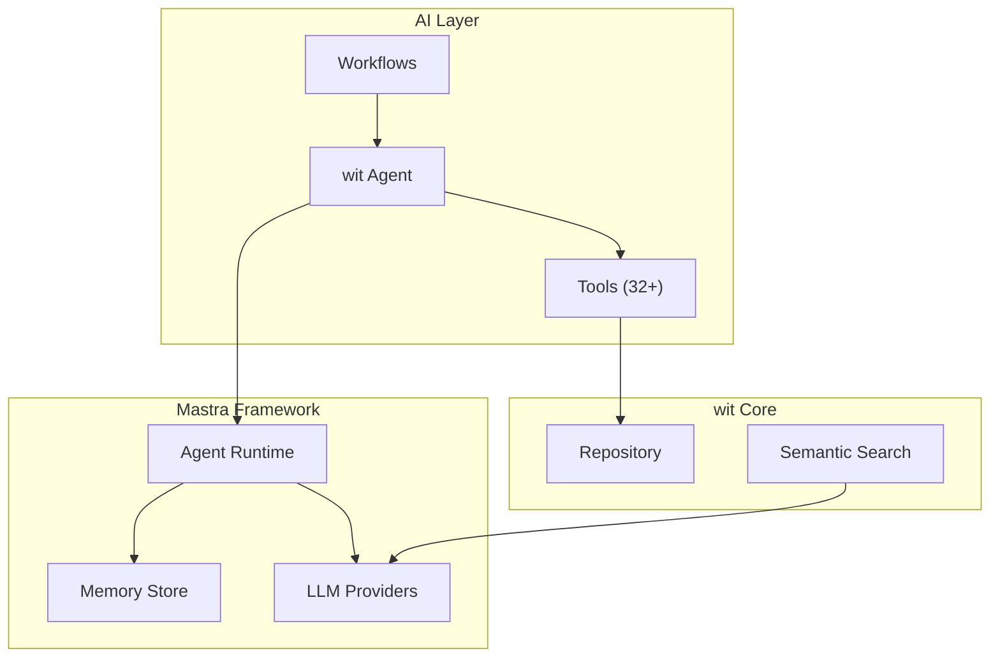
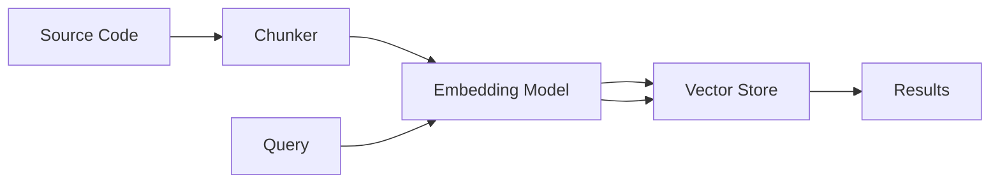

The `src/ai/` module provides AI-powered features using [Mastra](https://mastra.ai), an open-source AI agent framework. AI is deeply integrated into wit, not bolted on.

## Overview



## Key Files

| File | Purpose |
|------|---------|
| `mastra.ts` | Mastra configuration and instance management |
| `agent.ts` | Main wit agent definition |
| `types.ts` | Type definitions |
| `tools/` | 32+ agent tools |
| `workflows/` | Multi-step AI workflows |
| `agents/` | Specialized agents (code, PM, triage) |
| `services/` | AI services (PR review, conversation) |

## Mastra Configuration

wit uses Mastra for agent orchestration with support for multiple LLM providers.

```typescript
// src/ai/mastra.ts
import { Mastra } from '@mastra/core';

export function createTsgitMastra(options?: MastraOptions): Mastra {
  return new Mastra({
    agents: { wit: witAgent },
    tools: witTools,
    workflows: {
      prReview: prReviewWorkflow,
      issueTriage: issueTriageWorkflow,
      codeGeneration: codeGenerationWorkflow,
      multiAgentPlanning: multiAgentPlanningWorkflow,
    },
    storage: {
      // PostgreSQL or LibSQL for persistence
      type: 'postgres',
      connectionString: process.env.DATABASE_URL,
    },
  });
}

// Singleton access
export function getTsgitMastra(): Mastra;
export function getTsgitAgent(): Agent;
```

### LLM Provider Configuration

```typescript
// Supports multiple providers
const providers = {
  anthropic: {
    apiKey: process.env.ANTHROPIC_API_KEY,
    model: 'claude-sonnet-4-20250514',
  },
  openai: {
    apiKey: process.env.OPENAI_API_KEY,
    model: 'gpt-4o',
  },
};
```

## wit Agent

The main agent handles natural language Git operations.

```typescript
// src/ai/agent.ts
export const witAgent = {
  name: 'wit',
  instructions: `You are wit, an AI-powered Git assistant.
    You help developers with version control tasks including:
    - Creating and managing commits
    - Branch operations
    - Code review and analysis
    - Conflict resolution
    - Semantic code search

    Always explain what you're doing and ask for confirmation
    before making changes.`,
  tools: witTools,
  model: 'claude-sonnet-4-20250514',
};
```

### Agent Modes

The agent supports different operational modes:

```typescript
type AgentMode = 'interactive' | 'autonomous' | 'review';

interface AgentContext {
  mode: AgentMode;
  repoPath: string;
  branch?: string;
  sessionId?: string;
}
```

## Tools

Tools are the building blocks that give agents capabilities. wit provides 32+ tools.

### Tool Categories

#### Git Operations

| Tool | Description |
|------|-------------|
| `getStatus` | Get repository status |
| `getDiff` | Get diff of changes |
| `stageFiles` | Stage files for commit |
| `createCommit` | Create a commit |
| `getLog` | Get commit history |
| `getBranches` | List branches |
| `createBranch` | Create new branch |
| `switchBranch` | Switch to branch |
| `undo` | Undo last operation |

#### File Operations

| Tool | Description |
|------|-------------|
| `readFile` | Read file contents |
| `writeFile` | Write file |
| `editFile` | Edit file with diff |
| `listDirectory` | List directory contents |
| `runCommand` | Execute shell command |

#### Virtual Filesystem (Sandbox)

| Tool | Description |
|------|-------------|
| `virtualReadFile` | Read from virtual FS |
| `virtualWriteFile` | Write to virtual FS |
| `virtualEditFile` | Edit in virtual FS |
| `virtualListDirectory` | List virtual directory |
| `virtualStatus` | Get virtual FS status |
| `virtualCommit` | Commit virtual changes |

#### PR & Review

| Tool | Description |
|------|-------------|
| `openPullRequest` | Create pull request |
| `generatePRDescription` | AI-generate PR description |
| `reviewPR` | AI code review |
| `getMergeConflicts` | List conflicts |
| `resolveConflict` | AI conflict resolution |

#### Search

| Tool | Description |
|------|-------------|
| `search` | Text-based code search |
| `semanticSearch` | Vector-based semantic search |
| `indexRepository` | Index repo for search |
| `getIndexStatus` | Check index status |

### Tool Implementation

Tools follow the Mastra tool pattern:

```typescript
// src/ai/tools/get-status.ts
import { createTool } from '@mastra/core';
import { z } from 'zod';

export const getStatus = createTool({
  id: 'getStatus',
  description: 'Get the current status of the repository including staged, unstaged, and untracked files',
  inputSchema: z.object({
    path: z.string().optional().describe('Repository path'),
  }),
  execute: async ({ input, context }) => {
    const repo = await Repository.find(input.path || context.repoPath);

    const status = await repo.status();

    return {
      branch: repo.refs.getCurrentBranch(),
      staged: status.staged,
      unstaged: status.unstaged,
      untracked: status.untracked,
      conflicts: status.conflicts,
    };
  },
});
```

### Tool Registration

All tools are exported from `src/ai/tools/index.ts`:

```typescript
export const witTools = {
  // Git operations
  getStatus,
  getDiff,
  stageFiles,
  createCommit,
  getLog,
  getBranches,
  createBranch,
  switchBranch,
  undo,

  // File operations
  readFile,
  writeFile,
  editFile,
  listDirectory,
  runCommand,

  // Virtual FS
  virtualReadFile,
  virtualWriteFile,
  virtualEditFile,
  virtualListDirectory,
  virtualStatus,
  virtualCommit,

  // PR & Review
  openPullRequest,
  generatePRDescription,
  reviewPR,
  getMergeConflicts,
  resolveConflict,

  // Search
  search,
  semanticSearch,
  indexRepository,
  getIndexStatus,
};
```

## Workflows

Workflows are multi-step AI processes for complex tasks.

### PR Review Workflow

```typescript
// src/ai/workflows/pr-review.workflow.ts
export const prReviewWorkflow = createWorkflow({
  name: 'prReview',
  inputSchema: z.object({
    owner: z.string(),
    repo: z.string(),
    prNumber: z.number(),
  }),
  steps: [
    {
      name: 'fetchPR',
      execute: async ({ input }) => {
        // Fetch PR details and diff
      },
    },
    {
      name: 'analyzeChanges',
      execute: async ({ input, context }) => {
        // AI analysis of code changes
      },
    },
    {
      name: 'generateReview',
      execute: async ({ input, context }) => {
        // Generate review comments
      },
    },
    {
      name: 'postReview',
      execute: async ({ input, context }) => {
        // Post review to PR
      },
    },
  ],
});
```

### Issue Triage Workflow

```typescript
export const issueTriageWorkflow = createWorkflow({
  name: 'issueTriage',
  inputSchema: z.object({
    owner: z.string(),
    repo: z.string(),
    issueNumber: z.number(),
  }),
  steps: [
    { name: 'fetchIssue', execute: /* ... */ },
    { name: 'analyzeContent', execute: /* ... */ },
    { name: 'categorize', execute: /* ... */ },
    { name: 'assignLabels', execute: /* ... */ },
    { name: 'suggestAssignee', execute: /* ... */ },
  ],
});
```

### Code Generation Workflow

```typescript
export const codeGenerationWorkflow = createWorkflow({
  name: 'codeGeneration',
  inputSchema: z.object({
    description: z.string(),
    targetPath: z.string().optional(),
    language: z.string().optional(),
  }),
  steps: [
    { name: 'analyzeRequest', execute: /* ... */ },
    { name: 'planImplementation', execute: /* ... */ },
    { name: 'generateCode', execute: /* ... */ },
    { name: 'createTests', execute: /* ... */ },
    { name: 'reviewOutput', execute: /* ... */ },
  ],
});
```

### Multi-Agent Planning Workflow

```typescript
export const multiAgentPlanningWorkflow = createWorkflow({
  name: 'multiAgentPlanning',
  inputSchema: z.object({
    goal: z.string(),
    constraints: z.array(z.string()).optional(),
  }),
  steps: [
    { name: 'decomposeTask', execute: /* ... */ },
    { name: 'assignSubtasks', execute: /* ... */ },
    { name: 'executeParallel', execute: /* ... */ },
    { name: 'synthesizeResults', execute: /* ... */ },
  ],
});
```

### Running Workflows

```typescript
import { runPRReviewWorkflow, streamPRReviewWorkflow } from 'wit/ai';

// Blocking execution
const result = await runPRReviewWorkflow({
  owner: 'user',
  repo: 'my-repo',
  prNumber: 123,
});

// Streaming execution
for await (const event of streamPRReviewWorkflow(input)) {
  console.log(event.step, event.status);
}
```

## Specialized Agents

### Code Agent

Focused on autonomous code generation and modification:

```typescript
// src/ai/agents/code-agent.ts
export const codeAgent = {
  name: 'codeAgent',
  instructions: `You are a code generation agent. You:
    - Write clean, tested, documented code
    - Follow project conventions
    - Create appropriate commits
    - Never commit without confirmation`,
  tools: [
    readFile,
    writeFile,
    editFile,
    listDirectory,
    runCommand,
    createCommit,
    createBranch,
  ],
};
```

### PM Agent

Project management assistance:

```typescript
// src/ai/agents/pm-agent.ts
export const pmAgent = {
  name: 'pmAgent',
  instructions: `You are a project management agent. You:
    - Create and organize issues
    - Manage project boards
    - Track milestones
    - Generate status reports`,
  tools: [
    createIssue,
    updateIssue,
    createProject,
    updateProject,
    generateReport,
  ],
};
```

### Triage Agent

Automated issue triage:

```typescript
// src/ai/agents/triage-agent.ts
export const triageAgent = {
  name: 'triageAgent',
  instructions: `You are an issue triage agent. You:
    - Categorize incoming issues
    - Assign appropriate labels
    - Estimate priority
    - Suggest assignees based on expertise`,
  tools: [
    getIssue,
    updateIssue,
    addLabel,
    assignIssue,
  ],
};
```

## Semantic Search

The `src/search/` module provides vector-based code understanding.

### Architecture



### Indexing

```typescript
// src/search/semantic.ts
export class SemanticSearch {
  constructor(vectorStore: VectorStore, embeddings: EmbeddingModel);

  // Index a repository
  async indexRepository(repoPath: string): Promise<void>;

  // Search with natural language
  async search(query: string, options?: SearchOptions): Promise<SearchResult[]>;

  // Get index status
  getIndexStatus(repoPath: string): IndexStatus;
}
```

### Code Chunking

```typescript
// src/search/chunker.ts
export function chunkCode(
  content: string,
  language: string,
  options?: ChunkOptions
): CodeChunk[];

interface CodeChunk {
  content: string;
  startLine: number;
  endLine: number;
  type: 'function' | 'class' | 'block' | 'file';
  name?: string;
}
```

### Vector Store

```typescript
// src/search/vector-store.ts
export class VectorStore {
  // Add embeddings
  async add(vectors: EmbeddingVector[]): Promise<void>;

  // Search similar
  async search(query: number[], k: number): Promise<SearchResult[]>;

  // Delete by filter
  async delete(filter: Filter): Promise<void>;
}
```

## CLI Integration

AI features are exposed through CLI commands:

```bash
# AI commit message
wit ai commit

# AI code review
wit ai review

# Explain changes
wit ai explain

# Semantic search
wit search "authentication logic"

# Interactive agent
wit agent
```

## Server Integration

AI features are available via API:

```typescript
// Streaming agent endpoint
app.post('/api/agent/stream', async (req, res) => {
  const { message, sessionId } = req.body;

  for await (const chunk of agent.stream(message, { sessionId })) {
    res.write(JSON.stringify(chunk) + '\n');
  }

  res.end();
});

// Workflow endpoints
app.post('/api/workflows/pr-review', async (req, res) => {
  const result = await runPRReviewWorkflow(req.body);
  res.json(result);
});
```

## Extension Points

### Adding a Custom Tool

```typescript
// 1. Create the tool
const myTool = createTool({
  id: 'myTool',
  description: 'Does something useful',
  inputSchema: z.object({
    param: z.string(),
  }),
  execute: async ({ input }) => {
    // Implementation
    return { success: true };
  },
});

// 2. Add to tools index
export const witTools = {
  ...existingTools,
  myTool,
};
```

### Adding a Custom Workflow

```typescript
// 1. Define workflow
const myWorkflow = createWorkflow({
  name: 'myWorkflow',
  inputSchema: z.object({ /* ... */ }),
  steps: [
    { name: 'step1', execute: async () => { /* ... */ } },
    { name: 'step2', execute: async () => { /* ... */ } },
  ],
});

// 2. Register in Mastra config
workflows: {
  ...existingWorkflows,
  myWorkflow,
},
```

### Custom Embedding Model

```typescript
interface EmbeddingModel {
  embed(text: string): Promise<number[]>;
  embedBatch(texts: string[]): Promise<number[][]>;
  dimensions: number;
}

const customModel: EmbeddingModel = {
  embed: async (text) => { /* ... */ },
  embedBatch: async (texts) => { /* ... */ },
  dimensions: 1536,
};
```

## Environment Variables

```bash
# LLM Providers
ANTHROPIC_API_KEY=sk-...
OPENAI_API_KEY=sk-...

# Embedding model
EMBEDDING_MODEL=text-embedding-3-small

# Vector store (optional - uses local by default)
PINECONE_API_KEY=...
PINECONE_INDEX=wit-embeddings
```

## Related

<CardGroup cols={2}>
  <Card title="Agent Command" icon="robot" href="/commands/agent">
    Using the AI agent CLI
  </Card>
  <Card title="Search" icon="magnifying-glass" href="/features/search">
    Semantic search features
  </Card>
  <Card title="AI Workflows" icon="diagram-project" href="/features/ai-workflows">
    Multi-step AI workflows
  </Card>
</CardGroup>
