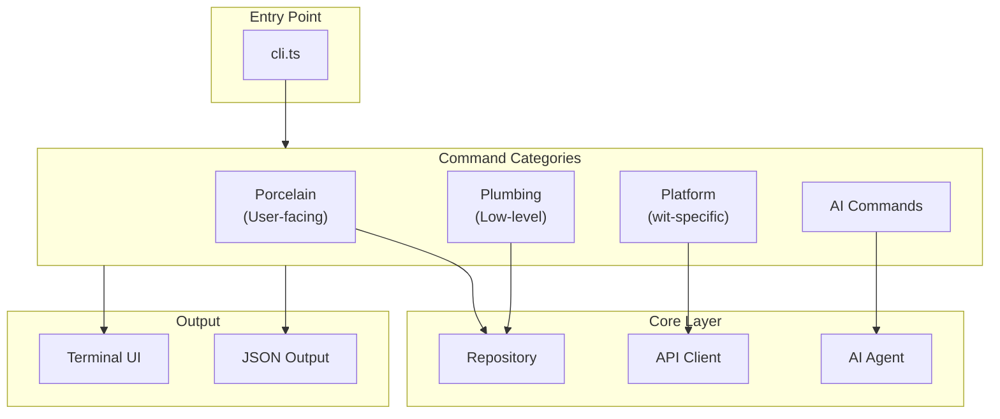

The `src/commands/` module contains wit's 75+ CLI commands. Commands are implemented using [Commander.js](https://github.com/tj/commander.js) for argument parsing and [Ink](https://github.com/vadimdemedes/ink) for terminal UI.

## Overview



## Key Files

| File | Purpose |
|------|---------|
| `cli.ts` | CLI entry point, command registration |
| `commands/index.ts` | Command exports |
| `commands/smart-status.ts` | The zero command (`wit` with no args) |
| `commands/command-help.ts` | Help system |

## Command Categories

### Porcelain (User-Facing)

Standard Git commands with improvements:

| Command | File | Description |
|---------|------|-------------|
| `init` | `init.ts` | Initialize repository |
| `add` | `add.ts` | Stage files |
| `commit` | `commit.ts` | Create commit |
| `status` | `status.ts` | Show status |
| `log` | `log.ts` | Show history |
| `branch` | `branch.ts` | Branch operations |
| `checkout` | `checkout.ts` | Checkout branches/files |
| `switch` | `switch.ts` | Switch branches (with auto-stash) |
| `merge` | `merge.ts` | Merge branches |
| `diff` | `diff.ts` | Show differences |
| `restore` | `restore.ts` | Restore files |

### Quality of Life

Commands that make Git easier:

| Command | File | Description |
|---------|------|-------------|
| `amend` | `amend.ts` | Amend last commit |
| `wip` | `wip.ts` | Quick WIP commit |
| `uncommit` | `uncommit.ts` | Undo last commit (keep changes) |
| `undo` | `undo.ts` | Journal-based undo |
| `cleanup` | `cleanup.ts` | Clean merged branches |
| `fixup` | `fixup.ts` | Create fixup commits |
| `snapshot` | `snapshot.ts` | Quick snapshots |
| `blame` | `blame.ts` | Annotate file history |
| `stats` | `stats.ts` | Repository statistics |

### History Rewriting

| Command | File | Description |
|---------|------|-------------|
| `cherry-pick` | `cherry-pick.ts` | Apply commits |
| `rebase` | `rebase.ts` | Rebase branches |
| `revert` | `revert.ts` | Revert commits |
| `reset` | `reset.ts` | Reset HEAD |
| `bisect` | `bisect.ts` | Binary search for bugs |

### Remote Operations

| Command | File | Description |
|---------|------|-------------|
| `clone` | `clone.ts` | Clone repository |
| `fetch` | `fetch.ts` | Fetch from remote |
| `pull` | `pull.ts` | Pull changes |
| `push` | `push.ts` | Push changes |
| `remote` | `remote.ts` | Manage remotes |

### Plumbing (Low-Level)

Internal commands for scripting:

| Command | File | Description |
|---------|------|-------------|
| `cat-file` | `cat-file.ts` | Show object contents |
| `hash-object` | `hash-object.ts` | Compute hash |
| `ls-files` | `ls-files.ts` | List tracked files |
| `ls-tree` | `ls-tree.ts` | List tree contents |
| `rev-parse` | `rev-parse.ts` | Parse revisions |
| `update-ref` | `update-ref.ts` | Update references |
| `symbolic-ref` | `symbolic-ref.ts` | Manage symbolic refs |
| `for-each-ref` | `for-each-ref.ts` | Iterate refs |
| `show-ref` | `show-ref.ts` | List references |
| `fsck` | `fsck.ts` | Verify repository |
| `gc` | `gc.ts` | Garbage collection |
| `reflog` | `reflog.ts` | Reference log |

### Platform Commands

wit-specific platform features:

| Command | File | Description |
|---------|------|-------------|
| `serve` | `serve.ts` | Start wit server |
| `pr` | `pr.ts` | Pull request management |
| `issue` | `issue.ts` | Issue tracking |
| `review` | `review.ts` | Code review |
| `stack` | `stack.ts` | Stacked diffs |
| `cycle` | `cycle.ts` | Sprint management |
| `project` | `project.ts` | Project management |
| `inbox` | `inbox.ts` | Notification inbox |
| `collaborator` | `collaborator.ts` | Team management |
| `token` | `token.ts` | Access tokens |
| `merge-queue` | `merge-queue.ts` | Merge queue |
| `ci` | `ci.ts` | CI/CD operations |
| `dashboard` | `dashboard.ts` | Project dashboard |
| `wrapped` | `wrapped.ts` | Activity insights |
| `journal` | `journal.ts` | Documentation |

### AI Commands

| Command | File | Description |
|---------|------|-------------|
| `ai` | `ai.ts` | AI assistant (commit, review, explain) |
| `agent` | `agent.ts` | Interactive AI agent |
| `plan` | `plan.ts` | AI planning |
| `search` | `search.ts` | Semantic search |

### Advanced

| Command | File | Description |
|---------|------|-------------|
| `stash` | `stash.ts` | Stash changes |
| `tag` | `tag.ts` | Tag management |
| `clean` | `clean.ts` | Remove untracked files |
| `show` | `show.ts` | Show objects |
| `worktree` | `worktree.ts` | Worktree management |
| `submodule` | `submodule.ts` | Submodule operations |
| `scope` | `scope.ts` | Monorepo scopes |
| `github` | `github.ts` | GitHub integration |
| `github-import` | `github-import.ts` | Import from GitHub |

## Command Implementation

### Basic Structure

```typescript
// src/commands/example.ts
import { Repository } from '../core/repository';

interface ExampleOptions {
  verbose?: boolean;
  force?: boolean;
}

export async function exampleCommand(
  args: string[],
  options: ExampleOptions
): Promise<void> {
  // Find repository
  const repo = await Repository.find(process.cwd());

  // Implement command logic
  // ...

  // Output results
  console.log('Done');
}
```

### With Terminal UI

```typescript
// src/commands/status.ts
import { Repository } from '../core/repository';
import { renderStatus } from '../ui/status';

export async function statusCommand(options: StatusOptions): Promise<void> {
  const repo = await Repository.find(process.cwd());

  const status = await repo.status();

  if (options.json) {
    console.log(JSON.stringify(status, null, 2));
  } else {
    renderStatus(status);
  }
}
```

### With API Client

```typescript
// src/commands/pr.ts
import { getApiClient } from '../api';

export async function prListCommand(options: PrListOptions): Promise<void> {
  const api = getApiClient();

  const prs = await api.pullRequest.list.query({
    owner: options.owner,
    repo: options.repo,
    state: options.state,
  });

  for (const pr of prs) {
    console.log(`#${pr.number} ${pr.title}`);
  }
}
```

### With AI Agent

```typescript
// src/commands/agent.ts
import { getTsgitAgent } from '../ai';
import { renderAgentChat } from '../ui/agent-panel';

export async function agentCommand(): Promise<void> {
  const agent = getTsgitAgent();

  // Interactive chat loop
  renderAgentChat(agent);
}
```

## CLI Entry Point

```typescript
// src/cli.ts
import { Command } from 'commander';

const program = new Command();

program
  .name('wit')
  .description('Git that understands your code')
  .version('2.0.0');

// Zero command (just 'wit')
program
  .action(smartStatus);

// Git commands
program
  .command('init')
  .description('Initialize a new repository')
  .option('--hash <algorithm>', 'Hash algorithm (sha1 or sha256)')
  .action(initCommand);

program
  .command('add <files...>')
  .description('Stage files for commit')
  .option('-A, --all', 'Stage all changes')
  .action(addCommand);

program
  .command('commit')
  .description('Create a commit')
  .option('-m, --message <message>', 'Commit message')
  .option('-a, --all', 'Stage all modified files')
  .action(commitCommand);

// AI commands
program
  .command('ai <subcommand>')
  .description('AI-powered features')
  .action(aiCommand);

// Platform commands
program
  .command('pr <subcommand>')
  .description('Pull request management')
  .action(prCommand);

// Parse and execute
program.parse(process.argv);
```

## The Zero Command

Running `wit` with no arguments shows intelligent status:

```typescript
// src/commands/smart-status.ts
export async function smartStatus(): Promise<void> {
  const repo = await Repository.find(process.cwd());

  // Get status
  const status = await repo.status();
  const branch = repo.refs.getCurrentBranch();

  // Analyze context
  const context = await analyzeContext(repo);

  // Render smart status
  console.log(`
  wit · ${repo.name}
  You're working on: ${context.description}

  ${formatStatus(status)}

  ──────────────────────────────────────────────────

  ${suggestNextActions(status, context)}
`);
}
```

Output:

```
  wit · my-project
  You're working on: feature: user authentication

  ● Ready to commit (3 files)
    API: auth.ts, middleware.ts
    Tests: auth.test.ts

  ──────────────────────────────────────────────────

  wit commit     · commit staged changes
  wit ai commit  · commit with AI-generated message
```

## Subcommand Patterns

### Subcommands with Commander

```typescript
// src/commands/pr.ts
const pr = program.command('pr').description('Pull request management');

pr.command('list')
  .description('List pull requests')
  .option('--state <state>', 'Filter by state')
  .action(prListCommand);

pr.command('create')
  .description('Create a pull request')
  .option('-t, --title <title>', 'PR title')
  .option('-b, --body <body>', 'PR body')
  .action(prCreateCommand);

pr.command('view <number>')
  .description('View pull request details')
  .action(prViewCommand);

pr.command('merge <number>')
  .description('Merge a pull request')
  .option('--squash', 'Squash commits')
  .option('--rebase', 'Rebase commits')
  .action(prMergeCommand);
```

### AI Subcommands

```typescript
// src/commands/ai.ts
const ai = program.command('ai').description('AI-powered features');

ai.command('commit')
  .description('Generate commit message with AI')
  .action(aiCommitCommand);

ai.command('review')
  .description('AI code review')
  .action(aiReviewCommand);

ai.command('explain')
  .description('Explain changes')
  .action(aiExplainCommand);

ai.command('resolve')
  .description('AI conflict resolution')
  .action(aiResolveCommand);
```

## Terminal UI Components

wit uses Ink for rich terminal interfaces:

### Status Display

```typescript
// src/ui/status.ts
import { render, Box, Text } from 'ink';

function StatusView({ status }: { status: Status }) {
  return (
    <Box flexDirection="column">
      <Text color="green">Staged:</Text>
      {status.staged.map((file) => (
        <Text key={file}> + {file}</Text>
      ))}

      <Text color="yellow">Modified:</Text>
      {status.unstaged.map((file) => (
        <Text key={file}> M {file}</Text>
      ))}
    </Box>
  );
}

export function renderStatus(status: Status) {
  render(<StatusView status={status} />);
}
```

### Interactive Selection

```typescript
// src/ui/select.ts
import { render, useInput, useState } from 'ink';

function SelectPrompt({ items, onSelect }) {
  const [selected, setSelected] = useState(0);

  useInput((input, key) => {
    if (key.upArrow) setSelected((s) => Math.max(0, s - 1));
    if (key.downArrow) setSelected((s) => Math.min(items.length - 1, s + 1));
    if (key.return) onSelect(items[selected]);
  });

  return (
    <Box flexDirection="column">
      {items.map((item, i) => (
        <Text key={i} color={i === selected ? 'cyan' : undefined}>
          {i === selected ? '❯' : ' '} {item}
        </Text>
      ))}
    </Box>
  );
}
```

### Progress Indicators

```typescript
// src/ui/progress.ts
import { render, Box, Text } from 'ink';
import Spinner from 'ink-spinner';

function ProgressView({ message, progress }) {
  return (
    <Box>
      <Text color="cyan">
        <Spinner type="dots" />
      </Text>
      <Text> {message}</Text>
      {progress && <Text> ({progress}%)</Text>}
    </Box>
  );
}
```

## Error Handling

Commands provide helpful error messages:

```typescript
// src/commands/checkout.ts
export async function checkoutCommand(ref: string): Promise<void> {
  try {
    const repo = await Repository.find(process.cwd());
    await repo.checkout(ref);
  } catch (error) {
    if (error.code === 'REF_NOT_FOUND') {
      console.error(`Branch '${ref}' not found.`);
      console.error('');
      console.error('Did you mean one of these?');

      const suggestions = await repo.refs.findSimilar(ref);
      for (const s of suggestions) {
        console.error(`  ${s}`);
      }

      console.error('');
      console.error('To create the branch:');
      console.error(`  wit checkout -b ${ref}`);

      process.exit(1);
    }
    throw error;
  }
}
```

## JSON Output

Most commands support `--json` for scripting:

```typescript
export async function statusCommand(options: { json?: boolean }): Promise<void> {
  const repo = await Repository.find(process.cwd());
  const status = await repo.status();

  if (options.json) {
    console.log(JSON.stringify(status, null, 2));
    return;
  }

  // Human-readable output
  renderStatus(status);
}
```

## Extension Points

### Adding a New Command

1. Create handler in `src/commands/`:

```typescript
// src/commands/my-command.ts
export async function myCommand(args: string[], options: MyOptions): Promise<void> {
  // Implementation
}
```

2. Register in CLI:

```typescript
// src/cli.ts
program
  .command('my-command <args...>')
  .description('Does something')
  .option('-v, --verbose', 'Verbose output')
  .action(myCommand);
```

3. Export from index:

```typescript
// src/commands/index.ts
export { myCommand } from './my-command';
```

### Adding Subcommands

```typescript
const myGroup = program.command('my-group').description('My command group');

myGroup.command('sub1').action(sub1Command);
myGroup.command('sub2').action(sub2Command);
```

### Custom UI Components

```typescript
// src/ui/my-component.tsx
import { Box, Text } from 'ink';

export function MyComponent({ data }: { data: MyData }) {
  return (
    <Box>
      <Text>{data.message}</Text>
    </Box>
  );
}
```

## Testing Commands

```typescript
// src/commands/__tests__/status.test.ts
import { statusCommand } from '../status';

describe('status command', () => {
  it('shows clean status', async () => {
    const output = await captureOutput(() => statusCommand({}));
    expect(output).toContain('nothing to commit');
  });

  it('shows staged files', async () => {
    await stageFile('test.txt');
    const output = await captureOutput(() => statusCommand({}));
    expect(output).toContain('test.txt');
  });
});
```

## Related

<CardGroup cols={2}>
  <Card title="Commands Reference" icon="terminal" href="/commands/overview">
    Full command documentation
  </Card>
  <Card title="Terminal UI" icon="display" href="/visual/terminal-ui">
    Terminal interface guide
  </Card>
</CardGroup>
