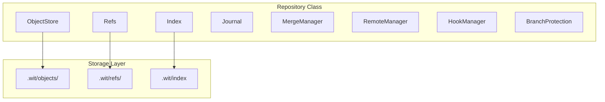
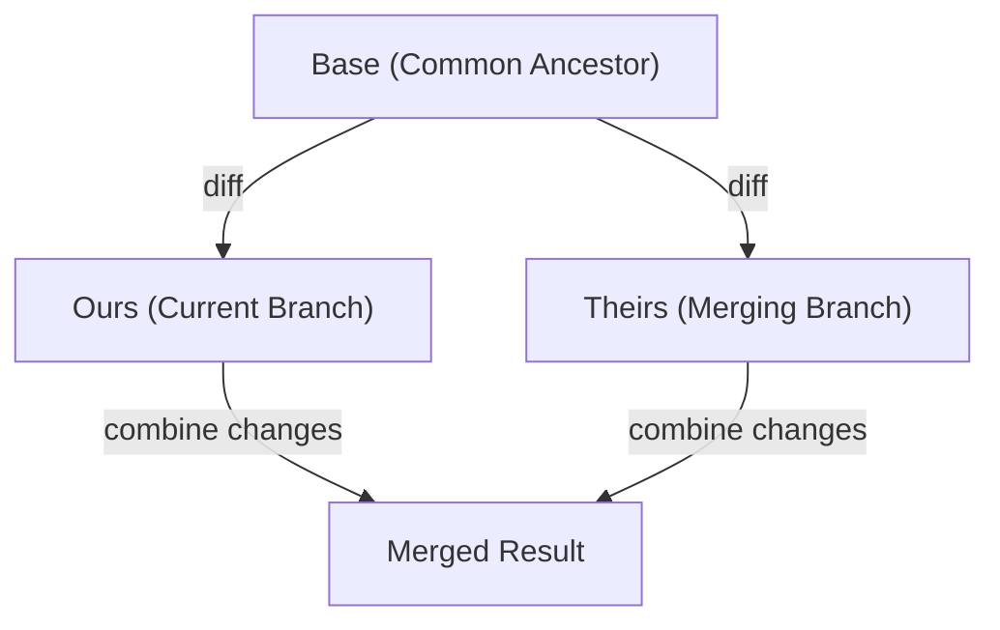
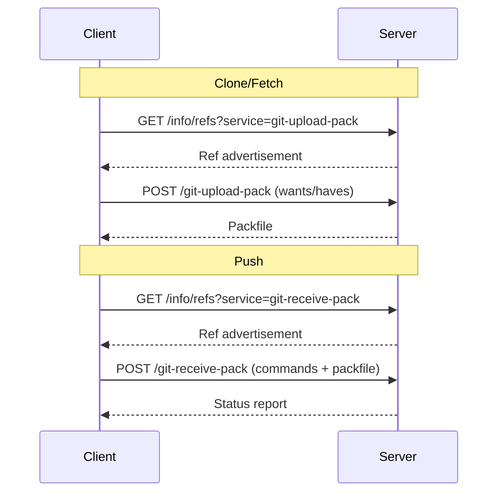

The `src/core/` module contains wit's complete Git implementation, written from scratch in TypeScript. This provides full Git compatibility while enabling improvements like better undo, auto-stash, and AI integration.

## Overview



## Key Files

| File | Purpose |
|------|---------|
| `repository.ts` | Main entry point - coordinates all Git operations |
| `object.ts` | Git object types: Blob, Tree, Commit, Tag |
| `object-store.ts` | Persistent storage with compression |
| `index.ts` | Staging area management |
| `refs.ts` | Branch and tag references |
| `journal.ts` | Operation history for undo |
| `merge.ts` | Three-way merge implementation |
| `diff.ts` | Unified diff generation |
| `remote.ts` | Remote repository management |
| `protocol/` | Git network protocols |

## Repository Class

The `Repository` class is the main entry point for all Git operations.

### Initialization

```typescript
import { Repository } from 'wit/core';

// Find existing repository
const repo = await Repository.find(process.cwd());

// Create new repository
const newRepo = Repository.init('/path/to/project');

// Open specific repository
const repo = new Repository('/path/to/project');
```

### Configuration

```typescript
interface RepositoryConfig {
  hashAlgorithm: 'sha1' | 'sha256';  // SHA-1 default for Git compat
  largeFileThreshold: number;         // Bytes before chunking (5MB)
  autoStashOnSwitch: boolean;         // Auto-stash dirty changes
}
```

### Core Properties

```typescript
class Repository {
  readonly gitDir: string;        // .wit directory path
  readonly workDir: string;       // Working directory path
  readonly objects: ObjectStore;  // Object persistence
  readonly index: Index;          // Staging area
  readonly refs: Refs;            // References
  readonly journal: Journal;      // Undo history
  readonly mergeManager: MergeManager;
  readonly remotes: RemoteManager;
  readonly hooks: HookManager;
  readonly branchProtection: BranchProtectionEngine;
  readonly collaborators: CollaboratorManager;
  // ... and more
}
```

## Git Objects

Git stores data as content-addressed objects. wit implements all four object types.

### Blob (File Content)

```typescript
class Blob {
  readonly type = 'blob';
  readonly content: Buffer;

  static fromContent(content: Buffer): Blob;
  serialize(): Buffer;
  hash(): string;
}
```

### Tree (Directory)

```typescript
interface TreeEntry {
  mode: FileMode;    // 100644 (file), 100755 (executable), 040000 (dir)
  name: string;      // Filename
  hash: string;      // Object hash
}

class Tree {
  readonly type = 'tree';
  readonly entries: TreeEntry[];

  static fromEntries(entries: TreeEntry[]): Tree;
  serialize(): Buffer;
  hash(): string;
}
```

### Commit

```typescript
interface Author {
  name: string;
  email: string;
  timestamp: Date;
  timezone: string;
}

class Commit {
  readonly type = 'commit';
  readonly tree: string;        // Tree hash
  readonly parents: string[];   // Parent commit hashes
  readonly author: Author;
  readonly committer: Author;
  readonly message: string;

  static create(options: CommitOptions): Commit;
  serialize(): Buffer;
  hash(): string;
}
```

### Tag

```typescript
class Tag {
  readonly type = 'tag';
  readonly object: string;      // Tagged object hash
  readonly objectType: string;  // Usually 'commit'
  readonly tag: string;         // Tag name
  readonly tagger: Author;
  readonly message: string;

  serialize(): Buffer;
  hash(): string;
}
```

## Object Store

The `ObjectStore` handles persistence with zlib compression.

```typescript
class ObjectStore {
  constructor(gitDir: string);

  // Write object, returns hash
  write(obj: GitObject): string;

  // Read object by hash
  read(hash: string): GitObject;

  // Check existence
  has(hash: string): boolean;

  // Write raw bytes
  writeRaw(hash: string, data: Buffer): void;
}
```

### Storage Format

Objects are stored in `.wit/objects/` using the first two characters of the hash as a directory:

```
.wit/objects/
├── ab/
│   └── cdef1234...  # Object with hash abcdef1234...
├── 12/
│   └── 3456789a...
└── pack/            # Packfiles for network transfer
```

Each object file contains:
```
<type> <size>\0<content>
```
Compressed with zlib.

## Index (Staging Area)

The `Index` manages the staging area for the next commit.

```typescript
interface IndexEntry {
  ctime: { seconds: number; nanoseconds: number };
  mtime: { seconds: number; nanoseconds: number };
  dev: number;
  ino: number;
  mode: FileMode;
  uid: number;
  gid: number;
  size: number;
  hash: string;
  flags: number;
  path: string;
}

class Index {
  constructor(gitDir: string);

  // Load index from disk
  load(): void;

  // Save index to disk
  save(): void;

  // Stage a file
  add(path: string, hash: string, mode: FileMode): void;

  // Remove from staging
  remove(path: string): void;

  // Get all entries
  getEntries(): IndexEntry[];

  // Build tree from index
  writeTree(): string;
}
```

## References

The `Refs` class manages branches, tags, and HEAD.

```typescript
interface Ref {
  name: string;       // e.g., "refs/heads/main"
  hash: string;       // Commit hash
  symbolic?: string;  // For symbolic refs like HEAD
}

class Refs {
  constructor(gitDir: string);

  // Get current HEAD
  getHead(): Ref;

  // Get current branch name
  getCurrentBranch(): string | null;

  // Resolve ref to hash
  resolve(refName: string): string;

  // Update ref
  updateRef(refName: string, hash: string): void;

  // Create symbolic ref
  createSymbolicRef(name: string, target: string): void;

  // List all refs
  listRefs(prefix?: string): Ref[];

  // Delete ref
  deleteRef(refName: string): void;
}
```

### Packed Refs

For performance, refs can be packed into a single file:

```
# .wit/packed-refs
abcd1234... refs/heads/main
efgh5678... refs/heads/feature
ijkl9012... refs/tags/v1.0.0
```

## Journal (Undo History)

The `Journal` provides true undo capability by recording all operations.

```typescript
interface JournalEntry {
  id: string;
  timestamp: Date;
  operation: string;      // 'commit', 'checkout', 'merge', etc.
  before: JournalState;   // State before operation
  after: JournalState;    // State after operation
  message?: string;
}

interface JournalState {
  head: string;
  branch: string | null;
  index: string;          // Serialized index hash
  workdir: string;        // Tree hash of working directory
}

class Journal {
  constructor(gitDir: string);

  // Record an operation
  record(operation: string, before: JournalState, after: JournalState): void;

  // Get recent entries
  getEntries(limit?: number): JournalEntry[];

  // Undo last operation
  undo(): JournalEntry | null;

  // Redo last undone operation
  redo(): JournalEntry | null;
}
```

## Merge System

The `MergeManager` handles three-way merges with conflict detection.

```typescript
interface MergeResult {
  success: boolean;
  conflicts: ConflictInfo[];
  tree?: string;          // Merged tree hash if successful
}

interface ConflictInfo {
  path: string;
  ours: string;           // Our version hash
  theirs: string;         // Their version hash
  base: string;           // Common ancestor hash
  markers?: string;       // Conflict markers in content
}

class MergeManager {
  constructor(repo: Repository, gitDir: string);

  // Perform merge
  merge(branchName: string, options?: MergeOptions): Promise<MergeResult>;

  // Get current conflicts
  getConflicts(): ConflictInfo[];

  // Mark conflict as resolved
  resolveConflict(path: string): void;

  // Abort merge
  abort(): void;

  // Continue after resolving
  continue(): Promise<MergeResult>;
}
```

### Three-Way Merge Algorithm



1. Find common ancestor (merge base)
2. Diff base → ours
3. Diff base → theirs
4. Apply non-conflicting changes
5. Mark conflicts for manual resolution

## Diff Engine

The `diff.ts` module generates unified diffs with rename detection.

```typescript
interface DiffOptions {
  contextLines?: number;     // Lines of context (default: 3)
  detectRenames?: boolean;   // Enable rename detection
  renameThreshold?: number;  // Similarity threshold (0-100)
}

interface DiffResult {
  oldPath: string;
  newPath: string;
  status: 'added' | 'deleted' | 'modified' | 'renamed';
  hunks: DiffHunk[];
}

interface DiffHunk {
  oldStart: number;
  oldLines: number;
  newStart: number;
  newLines: number;
  lines: DiffLine[];
}

// Generate diff between two trees
function diffTrees(
  oldTree: string,
  newTree: string,
  options?: DiffOptions
): DiffResult[];

// Generate diff for working directory
function diffWorkdir(
  repo: Repository,
  options?: DiffOptions
): DiffResult[];
```

## Protocol Layer

The `protocol/` directory implements Git network protocols.

### Smart HTTP

```typescript
// Client-side protocol
class SmartHttpClient {
  constructor(url: string, auth?: AuthCredentials);

  // Discover refs from server
  discoverRefs(): Promise<RefDiscovery>;

  // Fetch objects
  fetch(wants: string[], haves: string[]): Promise<Packfile>;

  // Push refs
  push(commands: RefCommand[]): Promise<PushResult>;
}
```

### Packfile Handling

```typescript
// Parse received packfile
class PackfileParser {
  parse(data: Buffer): GitObject[];
}

// Create packfile for sending
class PackfileWriter {
  constructor();
  addObject(obj: GitObject): void;
  finalize(): Buffer;
}
```

### Protocol Flow



## Remote Management

The `RemoteManager` handles remote repository configuration and operations.

```typescript
interface Remote {
  name: string;
  url: string;
  fetch?: string;   // Refspec for fetch
  push?: string;    // Refspec for push
}

class RemoteManager {
  constructor(gitDir: string);

  // Add remote
  add(name: string, url: string): void;

  // Remove remote
  remove(name: string): void;

  // Get remote
  get(name: string): Remote | null;

  // List remotes
  list(): Remote[];

  // Fetch from remote
  fetch(name: string, options?: FetchOptions): Promise<FetchResult>;

  // Push to remote
  push(name: string, branch: string, options?: PushOptions): Promise<PushResult>;
}
```

## Branch State Management

The `BranchStateManager` provides auto-stash on branch switch.

```typescript
class BranchStateManager {
  constructor(gitDir: string, workDir: string);

  // Save current state before switch
  saveBranchState(branchName: string): void;

  // Restore state after switch
  restoreBranchState(branchName: string): void;

  // Check for uncommitted changes
  hasUncommittedChanges(): boolean;
}
```

This allows seamless branch switching without losing work:

```bash
# Automatically stashes changes when switching
wit switch feature-branch

# Restores stashed changes when switching back
wit switch main
```

## Large File Handling

The `LargeFileHandler` chunks large files for better handling.

```typescript
const CHUNK_THRESHOLD = 5 * 1024 * 1024; // 5MB

class LargeFileHandler {
  constructor(gitDir: string);

  // Store large file as chunks
  store(content: Buffer): string;

  // Retrieve and reassemble
  retrieve(hash: string): Buffer;

  // Check if hash is a large file
  isLargeFile(hash: string): boolean;
}
```

## Hooks

The `HookManager` supports Git hooks for automation.

```typescript
type HookName =
  | 'pre-commit'
  | 'prepare-commit-msg'
  | 'commit-msg'
  | 'post-commit'
  | 'pre-push'
  | 'post-merge'
  | 'pre-rebase';

class HookManager {
  constructor(gitDir: string, workDir: string);

  // Run hook if it exists
  run(hook: HookName, args?: string[]): Promise<HookResult>;

  // Install hook script
  install(hook: HookName, script: string): void;

  // Check if hook exists
  exists(hook: HookName): boolean;
}
```

## Extension Points

### Custom Storage Backend

Implement the `StorageBackend` interface:

```typescript
interface StorageBackend {
  read(path: string): Promise<Buffer>;
  write(path: string, data: Buffer): Promise<void>;
  exists(path: string): Promise<boolean>;
  delete(path: string): Promise<void>;
  list(prefix: string): Promise<string[]>;
}

// Register custom backend
const repo = new Repository(workDir, {}, gitDir, customBackend);
```

### Custom Merge Driver

For specialized file types:

```typescript
interface MergeDriver {
  name: string;
  canMerge(path: string): boolean;
  merge(base: Buffer, ours: Buffer, theirs: Buffer): MergeDriverResult;
}

repo.mergeManager.registerDriver(customDriver);
```

## Related

<CardGroup cols={2}>
  <Card title="Git Protocol" icon="network-wired" href="/architecture/protocol">
    Network protocol details
  </Card>
  <Card title="Commands" icon="terminal" href="/architecture/cli">
    CLI command implementation
  </Card>
</CardGroup>
