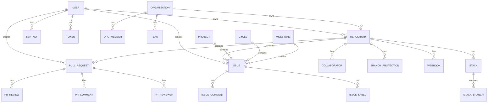

wit uses PostgreSQL with [Drizzle ORM](https://orm.drizzle.team/) for type-safe database access. The schema supports users, organizations, repositories, PRs, issues, and more.

## Overview



## Key Files

| File | Purpose |
|------|---------|
| `db/index.ts` | Database initialization and connection |
| `db/schema.ts` | Main schema definitions (37+ tables) |
| `db/auth-schema.ts` | Authentication tables (better-auth) |
| `db/admin-schema.ts` | Admin-specific schema |
| `db/seed.ts` | Database seeding |

## Enums

The schema uses PostgreSQL enums for type safety.

```typescript
// Owner types
export const ownerTypeEnum = pgEnum('owner_type', ['user', 'organization']);

// Pull request states
export const prStateEnum = pgEnum('pr_state', ['open', 'closed', 'merged']);

// Issue states
export const issueStateEnum = pgEnum('issue_state', ['open', 'closed']);

// Issue workflow status (Linear-style)
export const issueStatusEnum = pgEnum('issue_status', [
  'triage',
  'backlog',
  'todo',
  'in_progress',
  'in_review',
  'done',
  'canceled',
]);

// Issue priority
export const issuePriorityEnum = pgEnum('issue_priority', [
  'none', 'low', 'medium', 'high', 'urgent',
]);

// Project status
export const projectStatusEnum = pgEnum('project_status', [
  'backlog', 'planned', 'in_progress', 'paused', 'completed', 'canceled',
]);

// Review state
export const reviewStateEnum = pgEnum('review_state', [
  'pending', 'approved', 'changes_requested', 'commented',
]);

// Permissions
export const permissionEnum = pgEnum('permission', ['read', 'write', 'admin']);

// Organization roles
export const orgRoleEnum = pgEnum('org_role', ['member', 'admin', 'owner']);

// Workflow run states
export const workflowRunStateEnum = pgEnum('workflow_run_state', [
  'queued', 'in_progress', 'completed', 'failed', 'cancelled',
]);

// Merge queue states
export const mergeQueueStateEnum = pgEnum('merge_queue_state', [
  'pending', 'preparing', 'testing', 'ready', 'merging', 'completed', 'failed', 'cancelled',
]);
```

## Core Tables

### Users & Authentication

wit uses [better-auth](https://better-auth.com/) for authentication. User tables are defined in `auth-schema.ts`.

```typescript
// Main user table (better-auth)
export const user = pgTable('user', {
  id: text('id').primaryKey(),
  name: text('name').notNull(),
  email: text('email').notNull().unique(),
  emailVerified: boolean('email_verified').notNull(),
  image: text('image'),
  createdAt: timestamp('created_at').notNull(),
  updatedAt: timestamp('updated_at').notNull(),
});

// Sessions
export const session = pgTable('session', {
  id: text('id').primaryKey(),
  expiresAt: timestamp('expires_at').notNull(),
  token: text('token').notNull().unique(),
  userId: text('user_id').references(() => user.id),
  // ...
});

// OAuth accounts
export const account = pgTable('account', {
  id: text('id').primaryKey(),
  accountId: text('account_id').notNull(),
  providerId: text('provider_id').notNull(),
  userId: text('user_id').references(() => user.id),
  accessToken: text('access_token'),
  refreshToken: text('refresh_token'),
  // ...
});
```

### SSH Keys

```typescript
export const sshKeys = pgTable('ssh_keys', {
  id: uuid('id').primaryKey().defaultRandom(),
  userId: text('user_id').notNull().references(() => user.id),
  title: text('title').notNull(),
  publicKey: text('public_key').notNull(),
  fingerprint: text('fingerprint').notNull().unique(),
  keyType: text('key_type').notNull(),  // ssh-rsa, ssh-ed25519, etc.
  lastUsedAt: timestamp('last_used_at'),
  createdAt: timestamp('created_at').defaultNow().notNull(),
});
```

### Personal Access Tokens

```typescript
export const personalAccessTokens = pgTable('personal_access_tokens', {
  id: uuid('id').primaryKey().defaultRandom(),
  userId: text('user_id').notNull().references(() => user.id),
  name: text('name').notNull(),
  tokenHash: text('token_hash').notNull(),     // SHA256 hash
  tokenPrefix: text('token_prefix').notNull(),  // First 8 chars for ID
  scopes: text('scopes').notNull(),             // JSON array
  lastUsedAt: timestamp('last_used_at'),
  expiresAt: timestamp('expires_at'),           // null = never expires
  createdAt: timestamp('created_at').defaultNow().notNull(),
});
```

### Organizations

```typescript
export const organizations = pgTable('organizations', {
  id: uuid('id').primaryKey().defaultRandom(),
  name: text('name').notNull().unique(),        // URL slug
  displayName: text('display_name').notNull(),
  description: text('description'),
  avatarUrl: text('avatar_url'),
  website: text('website'),
  location: text('location'),
  createdAt: timestamp('created_at').defaultNow().notNull(),
  updatedAt: timestamp('updated_at').defaultNow().notNull(),
});

export const orgMembers = pgTable('org_members', {
  orgId: uuid('org_id').references(() => organizations.id),
  userId: text('user_id'),
  role: orgRoleEnum('role').default('member'),
  createdAt: timestamp('created_at').defaultNow().notNull(),
}, (table) => ({
  pk: primaryKey({ columns: [table.orgId, table.userId] }),
}));

export const teams = pgTable('teams', {
  id: uuid('id').primaryKey().defaultRandom(),
  orgId: uuid('org_id').references(() => organizations.id),
  name: text('name').notNull(),
  description: text('description'),
  createdAt: timestamp('created_at').defaultNow().notNull(),
});
```

### Repositories

```typescript
export const repositories = pgTable('repositories', {
  id: uuid('id').primaryKey().defaultRandom(),
  ownerId: text('owner_id').notNull(),
  ownerType: ownerTypeEnum('owner_type').notNull(),
  name: text('name').notNull(),
  description: text('description'),
  isPrivate: boolean('is_private').default(false),
  isFork: boolean('is_fork').default(false),
  forkedFromId: uuid('forked_from_id').references(() => repositories.id),
  defaultBranch: text('default_branch').default('main'),

  // Cached stats
  starsCount: integer('stars_count').default(0),
  forksCount: integer('forks_count').default(0),
  watchersCount: integer('watchers_count').default(0),
  openIssuesCount: integer('open_issues_count').default(0),
  openPrsCount: integer('open_prs_count').default(0),

  // Language stats (JSON)
  languageStats: jsonb('language_stats'),
  languageStatsUpdatedAt: timestamp('language_stats_updated_at'),

  // Filesystem path
  diskPath: text('disk_path').notNull(),

  createdAt: timestamp('created_at').defaultNow().notNull(),
  updatedAt: timestamp('updated_at').defaultNow().notNull(),
  pushedAt: timestamp('pushed_at'),
});

export const collaborators = pgTable('collaborators', {
  repoId: uuid('repo_id').references(() => repositories.id),
  userId: text('user_id'),
  permission: permissionEnum('permission').default('read'),
  createdAt: timestamp('created_at').defaultNow().notNull(),
}, (table) => ({
  pk: primaryKey({ columns: [table.repoId, table.userId] }),
}));

export const branchProtectionRules = pgTable('branch_protection_rules', {
  id: uuid('id').primaryKey().defaultRandom(),
  repoId: uuid('repo_id').references(() => repositories.id),
  pattern: text('pattern').notNull(),           // e.g., "main", "release/*"
  requirePullRequest: boolean('require_pull_request').default(true),
  requiredReviewers: integer('required_reviewers').default(1),
  requireStatusChecks: boolean('require_status_checks').default(false),
  requiredStatusChecks: text('required_status_checks'),  // JSON array
  allowForcePush: boolean('allow_force_push').default(false),
  allowDeletion: boolean('allow_deletion').default(false),
  createdAt: timestamp('created_at').defaultNow().notNull(),
  updatedAt: timestamp('updated_at').defaultNow().notNull(),
});
```

### Pull Requests

```typescript
export const pullRequests = pgTable('pull_requests', {
  id: uuid('id').primaryKey().defaultRandom(),
  repoId: uuid('repo_id').references(() => repositories.id),
  number: integer('number').notNull(),
  title: text('title').notNull(),
  body: text('body'),
  state: prStateEnum('state').default('open'),
  sourceBranch: text('source_branch').notNull(),
  targetBranch: text('target_branch').notNull(),
  sourceRepoId: uuid('source_repo_id').references(() => repositories.id),
  headSha: text('head_sha').notNull(),
  baseSha: text('base_sha').notNull(),
  mergeSha: text('merge_sha'),
  authorId: text('author_id').notNull(),
  milestoneId: uuid('milestone_id').references(() => milestones.id),
  stackId: uuid('stack_id').references(() => stacks.id),
  isDraft: boolean('is_draft').default(false),
  isMergeable: boolean('is_mergeable'),
  createdAt: timestamp('created_at').defaultNow().notNull(),
  updatedAt: timestamp('updated_at').defaultNow().notNull(),
  mergedAt: timestamp('merged_at'),
  closedAt: timestamp('closed_at'),
  mergedById: text('merged_by_id'),
});

export const prReviews = pgTable('pr_reviews', {
  id: uuid('id').primaryKey().defaultRandom(),
  prId: uuid('pr_id').references(() => pullRequests.id),
  userId: text('user_id').notNull(),
  state: reviewStateEnum('state').notNull(),
  body: text('body'),
  commitSha: text('commit_sha').notNull(),
  createdAt: timestamp('created_at').defaultNow().notNull(),
  updatedAt: timestamp('updated_at').defaultNow().notNull(),
});

export const prComments = pgTable('pr_comments', {
  id: uuid('id').primaryKey().defaultRandom(),
  prId: uuid('pr_id').references(() => pullRequests.id),
  reviewId: uuid('review_id').references(() => prReviews.id),
  userId: text('user_id').notNull(),
  path: text('path'),              // File path for inline
  line: integer('line'),           // Line number
  side: text('side'),              // LEFT or RIGHT
  commitSha: text('commit_sha'),
  startLine: integer('start_line'),
  endLine: integer('end_line'),
  body: text('body').notNull(),
  replyToId: uuid('reply_to_id'),
  isResolved: boolean('is_resolved').default(false),
  suggestion: text('suggestion'),
  suggestionApplied: boolean('suggestion_applied').default(false),
  createdAt: timestamp('created_at').defaultNow().notNull(),
  updatedAt: timestamp('updated_at').defaultNow().notNull(),
});

export const prReviewers = pgTable('pr_reviewers', {
  id: uuid('id').primaryKey().defaultRandom(),
  prId: uuid('pr_id').references(() => pullRequests.id),
  userId: text('user_id').notNull(),
  requestedById: text('requested_by_id').notNull(),
  state: reviewRequestStateEnum('state').default('pending'),
  requestedAt: timestamp('requested_at').defaultNow().notNull(),
  completedAt: timestamp('completed_at'),
});
```

### Issues

```typescript
export const issues = pgTable('issues', {
  id: uuid('id').primaryKey().defaultRandom(),
  repoId: uuid('repo_id').references(() => repositories.id),
  number: integer('number').notNull(),
  title: text('title').notNull(),
  body: text('body'),
  state: issueStateEnum('state').default('open'),
  status: issueStatusEnum('status').default('backlog'),
  stageId: uuid('stage_id').references(() => issueStages.id),
  priority: issuePriorityEnum('priority').default('none'),
  dueDate: timestamp('due_date'),
  estimate: integer('estimate'),
  authorId: text('author_id').notNull(),
  assigneeId: text('assignee_id'),
  parentId: uuid('parent_id'),          // Sub-issues
  milestoneId: uuid('milestone_id').references(() => milestones.id),
  projectId: uuid('project_id'),
  cycleId: uuid('cycle_id'),
  createdAt: timestamp('created_at').defaultNow().notNull(),
  updatedAt: timestamp('updated_at').defaultNow().notNull(),
  closedAt: timestamp('closed_at'),
  closedById: text('closed_by_id'),
});

export const issueStages = pgTable('issue_stages', {
  id: uuid('id').primaryKey().defaultRandom(),
  repoId: uuid('repo_id').references(() => repositories.id),
  key: text('key').notNull(),
  name: text('name').notNull(),
  description: text('description'),
  icon: text('icon').default('○'),
  color: text('color').default('6b7280'),
  position: integer('position').default(0),
  isClosedState: boolean('is_closed_state').default(false),
  isTriageState: boolean('is_triage_state').default(false),
  isDefault: boolean('is_default').default(false),
  isSystem: boolean('is_system').default(false),
  createdAt: timestamp('created_at').defaultNow().notNull(),
  updatedAt: timestamp('updated_at').defaultNow().notNull(),
});

export const labels = pgTable('labels', {
  id: uuid('id').primaryKey().defaultRandom(),
  repoId: uuid('repo_id').references(() => repositories.id),
  name: text('name').notNull(),
  color: text('color').default('888888'),
  description: text('description'),
  createdAt: timestamp('created_at').defaultNow().notNull(),
});

export const issueRelations = pgTable('issue_relations', {
  id: uuid('id').primaryKey().defaultRandom(),
  sourceIssueId: uuid('source_issue_id').references(() => issues.id),
  targetIssueId: uuid('target_issue_id').references(() => issues.id),
  type: issueRelationTypeEnum('type').notNull(),
  createdAt: timestamp('created_at').defaultNow().notNull(),
});
```

### Projects & Cycles

```typescript
export const projects = pgTable('projects', {
  id: uuid('id').primaryKey().defaultRandom(),
  repoId: uuid('repo_id').references(() => repositories.id),
  name: text('name').notNull(),
  description: text('description'),
  status: projectStatusEnum('status').default('backlog'),
  health: projectHealthEnum('health').default('on_track'),
  startDate: timestamp('start_date'),
  targetDate: timestamp('target_date'),
  leadId: text('lead_id'),
  createdAt: timestamp('created_at').defaultNow().notNull(),
  updatedAt: timestamp('updated_at').defaultNow().notNull(),
});

export const cycles = pgTable('cycles', {
  id: uuid('id').primaryKey().defaultRandom(),
  repoId: uuid('repo_id').references(() => repositories.id),
  name: text('name').notNull(),
  description: text('description'),
  startDate: timestamp('start_date').notNull(),
  endDate: timestamp('end_date').notNull(),
  isActive: boolean('is_active').default(false),
  createdAt: timestamp('created_at').defaultNow().notNull(),
  updatedAt: timestamp('updated_at').defaultNow().notNull(),
});
```

### Stacks (Stacked Diffs)

```typescript
export const stacks = pgTable('stacks', {
  id: uuid('id').primaryKey().defaultRandom(),
  repoId: uuid('repo_id').references(() => repositories.id),
  name: text('name').notNull(),
  description: text('description'),
  baseBranch: text('base_branch').notNull(),
  authorId: text('author_id').notNull(),
  createdAt: timestamp('created_at').defaultNow().notNull(),
  updatedAt: timestamp('updated_at').defaultNow().notNull(),
});

export const stackBranches = pgTable('stack_branches', {
  id: uuid('id').primaryKey().defaultRandom(),
  stackId: uuid('stack_id').references(() => stacks.id),
  branchName: text('branch_name').notNull(),
  position: integer('position').notNull(),
  prId: uuid('pr_id').references(() => pullRequests.id),
  createdAt: timestamp('created_at').defaultNow().notNull(),
});
```

### CI/CD

```typescript
export const workflowRuns = pgTable('workflow_runs', {
  id: uuid('id').primaryKey().defaultRandom(),
  repoId: uuid('repo_id').references(() => repositories.id),
  workflowName: text('workflow_name').notNull(),
  state: workflowRunStateEnum('state').default('queued'),
  branch: text('branch').notNull(),
  commitSha: text('commit_sha').notNull(),
  triggeredBy: text('triggered_by').notNull(),
  prId: uuid('pr_id').references(() => pullRequests.id),
  startedAt: timestamp('started_at'),
  completedAt: timestamp('completed_at'),
  createdAt: timestamp('created_at').defaultNow().notNull(),
});

export const jobRuns = pgTable('job_runs', {
  id: uuid('id').primaryKey().defaultRandom(),
  workflowRunId: uuid('workflow_run_id').references(() => workflowRuns.id),
  name: text('name').notNull(),
  state: workflowRunStateEnum('state').default('queued'),
  runnerType: text('runner_type'),
  startedAt: timestamp('started_at'),
  completedAt: timestamp('completed_at'),
  createdAt: timestamp('created_at').defaultNow().notNull(),
});

export const stepRuns = pgTable('step_runs', {
  id: uuid('id').primaryKey().defaultRandom(),
  jobRunId: uuid('job_run_id').references(() => jobRuns.id),
  name: text('name').notNull(),
  state: workflowRunStateEnum('state').default('queued'),
  exitCode: integer('exit_code'),
  output: text('output'),
  startedAt: timestamp('started_at'),
  completedAt: timestamp('completed_at'),
  createdAt: timestamp('created_at').defaultNow().notNull(),
});
```

### Merge Queue

```typescript
export const mergeQueueConfig = pgTable('merge_queue_config', {
  id: uuid('id').primaryKey().defaultRandom(),
  repoId: uuid('repo_id').references(() => repositories.id).unique(),
  enabled: boolean('enabled').default(false),
  strategy: mergeQueueStrategyEnum('strategy').default('sequential'),
  maxBatchSize: integer('max_batch_size').default(5),
  mergeMethod: text('merge_method').default('merge'),
  requiredChecks: text('required_checks'),    // JSON array
  createdAt: timestamp('created_at').defaultNow().notNull(),
  updatedAt: timestamp('updated_at').defaultNow().notNull(),
});

export const mergeQueueEntries = pgTable('merge_queue_entries', {
  id: uuid('id').primaryKey().defaultRandom(),
  repoId: uuid('repo_id').references(() => repositories.id),
  prId: uuid('pr_id').references(() => pullRequests.id),
  state: mergeQueueStateEnum('state').default('pending'),
  position: integer('position').notNull(),
  priority: integer('priority').default(0),
  addedById: text('added_by_id').notNull(),
  batchId: uuid('batch_id'),
  speculativeMergeSha: text('speculative_merge_sha'),
  createdAt: timestamp('created_at').defaultNow().notNull(),
  updatedAt: timestamp('updated_at').defaultNow().notNull(),
});
```

### Agent & AI

```typescript
export const agentSessions = pgTable('agent_sessions', {
  id: uuid('id').primaryKey().defaultRandom(),
  repoId: uuid('repo_id').references(() => repositories.id),
  userId: text('user_id').notNull(),
  title: text('title'),
  status: text('status').default('active'),
  createdAt: timestamp('created_at').defaultNow().notNull(),
  updatedAt: timestamp('updated_at').defaultNow().notNull(),
});

export const agentMessages = pgTable('agent_messages', {
  id: uuid('id').primaryKey().defaultRandom(),
  sessionId: uuid('session_id').references(() => agentSessions.id),
  role: text('role').notNull(),              // user, assistant, system
  content: text('content').notNull(),
  toolCalls: jsonb('tool_calls'),
  createdAt: timestamp('created_at').defaultNow().notNull(),
});

export const agentFileChanges = pgTable('agent_file_changes', {
  id: uuid('id').primaryKey().defaultRandom(),
  sessionId: uuid('session_id').references(() => agentSessions.id),
  path: text('path').notNull(),
  changeType: text('change_type').notNull(),  // create, modify, delete
  diff: text('diff'),
  committed: boolean('committed').default(false),
  commitSha: text('commit_sha'),
  createdAt: timestamp('created_at').defaultNow().notNull(),
});
```

## Database Initialization

```typescript
// src/db/index.ts
import { drizzle } from 'drizzle-orm/postgres-js';
import postgres from 'postgres';

let db: ReturnType<typeof drizzle> | null = null;

export function initDatabase(connectionString: string) {
  const client = postgres(connectionString);
  db = drizzle(client, { schema });
  return db;
}

export function getDb() {
  if (!db) {
    throw new Error('Database not initialized');
  }
  return db;
}

export async function healthCheck(): Promise<{ ok: boolean; latency: number }> {
  const start = Date.now();
  try {
    await db.execute(sql`SELECT 1`);
    return { ok: true, latency: Date.now() - start };
  } catch {
    return { ok: false, latency: Date.now() - start };
  }
}
```

## Query Examples

### Get Repository with Stats

```typescript
const repo = await db.query.repositories.findFirst({
  where: and(
    eq(repositories.ownerId, ownerId),
    eq(repositories.name, name),
  ),
  with: {
    collaborators: true,
    labels: true,
    stars: { limit: 5 },
  },
});
```

### Get PR with Reviews

```typescript
const pr = await db.query.pullRequests.findFirst({
  where: eq(pullRequests.id, prId),
  with: {
    reviews: {
      with: { comments: true },
      orderBy: desc(prReviews.createdAt),
    },
    comments: {
      where: isNull(prComments.reviewId),
    },
    reviewers: true,
  },
});
```

### Get Issues for Kanban

```typescript
const issues = await db.query.issues.findMany({
  where: and(
    eq(issues.repoId, repoId),
    eq(issues.state, 'open'),
  ),
  with: {
    assignee: true,
    labels: { with: { label: true } },
  },
  orderBy: [
    asc(issues.status),
    desc(issues.priority),
    desc(issues.createdAt),
  ],
});
```

## Migrations

wit uses Drizzle Kit for migrations:

```bash
# Generate migration
npm run db:generate

# Apply migrations
npm run db:migrate

# Push schema directly (development)
npm run db:push
```

## Related

<CardGroup cols={2}>
  <Card title="API Reference" icon="code" href="/api-reference/overview">
    API documentation
  </Card>
  <Card title="Self-Hosting" icon="server" href="/platform/self-hosting">
    Database setup guide
  </Card>
</CardGroup>
