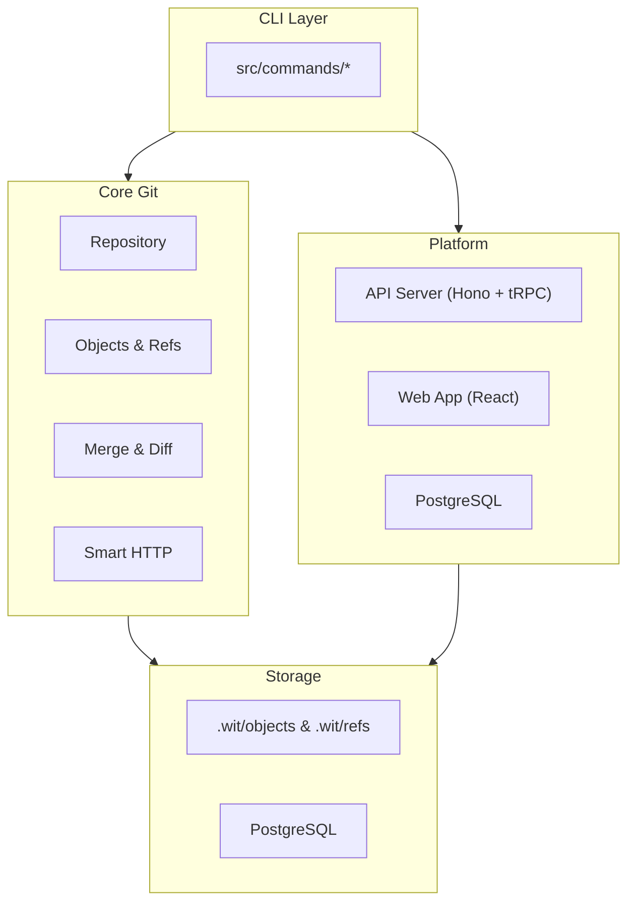

wit is a Git-compatible version control system written in TypeScript, with an integrated hosting platform.

## Key Components

| Directory | Purpose |
|-----------|---------|
| `src/commands/` | CLI command handlers |
| `src/core/` | Git internals: objects, refs, index, merge, diff |
| `src/core/protocol/` | Smart HTTP, packfile read/write |
| `src/server/` | Hono server, Git HTTP endpoints |
| `src/api/trpc/` | tRPC routers for the platform API |
| `src/db/` | Drizzle schema and data models |
| `src/ai/` | AI agent and tools |
| `src/ui/` | Terminal UI, web UI, graph rendering |

## How Git Storage Works

wit stores data the same way Git does:

- **Objects** (blobs, trees, commits, tags) are content-addressed by SHA-1 hash
- **Refs** (branches, tags) are files containing commit hashes
- **Index** tracks staged files for the next commit
- **Packfiles** bundle objects for network transfer

All objects live in `.wit/objects/`, refs in `.wit/refs/`.

## Network Protocol

wit implements Git Smart HTTP for clone/fetch/push:

1. Client discovers refs via `GET /info/refs`
2. Client/server exchange packfiles via `POST /git-upload-pack` or `/git-receive-pack`

## Platform

The hosting platform adds:

- **PostgreSQL** for users, orgs, repos, PRs, issues
- **tRPC API** for the web app and CLI commands like `wit pr`
- **React web app** for browsing repos and managing PRs

## Detailed Documentation

For comprehensive architecture documentation, see:

<CardGroup cols={2}>
  <Card title="System Overview" icon="sitemap" href="/architecture/system-overview">
    Complete system architecture with diagrams
  </Card>
  <Card title="Core Git" icon="code-branch" href="/architecture/core">
    Git implementation details
  </Card>
  <Card title="AI System" icon="robot" href="/architecture/ai">
    AI agents, tools, and workflows
  </Card>
  <Card title="Server" icon="server" href="/architecture/server">
    HTTP, SSH, and API architecture
  </Card>
  <Card title="Database" icon="database" href="/architecture/database">
    PostgreSQL schema and models
  </Card>
  <Card title="Events System" icon="bell" href="/architecture/events">
    Event-driven architecture
  </Card>
  <Card title="CLI" icon="terminal" href="/architecture/cli">
    Command structure and patterns
  </Card>
  <Card title="Primitives" icon="cube" href="/architecture/primitives">
    Git-backed building blocks
  </Card>
</CardGroup>
