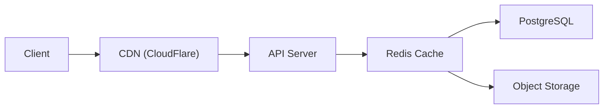

# Scaling wit to Millions of Repositories

This document analyzes the current wit architecture and provides recommendations for scaling to support millions of repositories, millions of users, and enterprise-grade performance.

---

## Executive Summary

wit's current architecture is designed for self-hosted single-server deployments. To scale to millions of repos, we need changes across five key areas:

| Area | Current State | Target State |
|------|---------------|--------------|
| **Storage** | Local disk | Distributed object storage |
| **Database** | Single PostgreSQL | Clustered PostgreSQL with read replicas |
| **Search** | File-based vectors | Dedicated vector database |
| **Compute** | Single process | Horizontally scaled workers |
| **Caching** | In-memory | Distributed Redis cluster |

---

## Current Architecture Analysis

### 1. Repository Storage (`src/server/storage/repos.ts`)

**Current Implementation:**
- Bare repositories stored on local filesystem at `./repos/owner/repo.git`
- Objects stored in standard Git format (loose objects + packfiles)
- `RepoManager` maintains an in-memory cache of repository handles

**Bottlenecks at Scale:**
- ❌ Single disk I/O bottleneck
- ❌ No object deduplication across repos (forked repos duplicate all objects)
- ❌ Filesystem limits (inodes, directory entries)
- ❌ No horizontal scaling capability

**Current Code:**
```typescript
// src/server/storage/repos.ts
export class RepoManager {
  private repoCache: Map<string, BareRepository> = new Map();
  
  constructor(private baseDir: string) {
    // All repos on single disk
    mkdirp(this.baseDir);
  }
}
```

### 2. Database Layer (`src/db/index.ts`)

**Current Implementation:**
- PostgreSQL with Drizzle ORM
- Single connection pool (default `pg` pool settings)
- Good index coverage for common queries

**Bottlenecks at Scale:**
- ⚠️ No explicit connection pool sizing
- ⚠️ Single-region database
- ⚠️ Large tables without partitioning (issues, activities, notifications)
- ⚠️ No read replicas configured

**Current Code:**
```typescript
// src/db/index.ts
export function initDatabase(connectionString: string | PoolConfig): Database {
  pool = new Pool(config);  // Default pool settings
  db = drizzle(pool, { schema });
  return db;
}
```

### 3. Vector Search (`src/search/vector-store.ts`)

**Current Implementation:**
- File-based JSON storage per repository
- Linear scan similarity search
- In-memory LRU cache (10,000 vectors default)

**Bottlenecks at Scale:**
- ❌ O(n) query time for similarity search
- ❌ No cross-repository search capability
- ❌ Limited to single-machine memory
- ❌ Index stored per-repo, not centralized

**Current Code:**
```typescript
// src/search/vector-store.ts
async query(queryEmbedding: number[], options): Promise<VectorQueryResult[]> {
  // Linear scan through ALL vectors
  for (const fileInfo of Object.values(this.index!.files)) {
    for (const id of fileInfo.vectorIds) {
      const vector = this.loadVector(id);
      const similarity = cosineSimilarity(queryEmbedding, vector.embedding);
      // ...
    }
  }
}
```

### 4. Git Protocol (`src/server/routes/git.ts`)

**Current Implementation:**
- Smart HTTP protocol (git-upload-pack, git-receive-pack)
- Synchronous packfile creation/parsing
- No request queuing or prioritization

**Bottlenecks at Scale:**
- ❌ CPU-bound packfile operations block event loop
- ❌ Large clone operations tie up server resources
- ❌ No streaming for large packfiles

### 5. Rate Limiting (`src/server/middleware/rate-limit.ts`)

**Current Implementation:**
- In-memory rate limiting (MemoryStore)
- Redis store available but not default
- User-aware rate limiting option

**Bottlenecks at Scale:**
- ⚠️ In-memory store doesn't work with multiple instances
- ✅ Redis store already implemented (good!)

---

## Scaling Recommendations

### Phase 1: Foundation (1M repos)

#### 1.1 Implement Repository Sharding

Distribute repositories across multiple storage backends using consistent hashing.

```typescript
// Proposed: src/server/storage/sharded-repos.ts

import { createHash } from 'crypto';

interface ShardConfig {
  shards: StorageBackend[];
  replicationFactor: number;
}

export class ShardedRepoManager {
  private shards: StorageBackend[];
  
  constructor(config: ShardConfig) {
    this.shards = config.shards;
  }
  
  /**
   * Determine which shard(s) a repository belongs to
   */
  private getShardForRepo(owner: string, repo: string): StorageBackend {
    const key = `${owner}/${repo}`;
    const hash = createHash('sha256').update(key).digest();
    const shardIndex = hash.readUInt32BE(0) % this.shards.length;
    return this.shards[shardIndex];
  }
  
  /**
   * Get repository from appropriate shard
   */
  async getRepo(owner: string, repo: string): Promise<BareRepository | null> {
    const shard = this.getShardForRepo(owner, repo);
    return shard.getRepository(owner, repo);
  }
}
```

#### 1.2 Introduce Object Storage Backend

Replace local disk with S3-compatible object storage for Git objects.

```typescript
// Proposed: src/core/storage/s3-object-store.ts

import { S3Client, GetObjectCommand, PutObjectCommand } from '@aws-sdk/client-s3';

export class S3ObjectStore {
  private s3: S3Client;
  private bucket: string;
  
  constructor(config: S3Config) {
    this.s3 = new S3Client(config);
    this.bucket = config.bucket;
  }
  
  /**
   * Store object with content-addressable key
   * Enables deduplication across ALL repositories
   */
  async writeObject(type: ObjectType, content: Buffer): Promise<string> {
    const hash = hashObject(type, content);
    const key = `objects/${hash.slice(0, 2)}/${hash.slice(2)}`;
    
    await this.s3.send(new PutObjectCommand({
      Bucket: this.bucket,
      Key: key,
      Body: createObjectBuffer(type, content),
      ContentType: 'application/x-git-object',
      // Deduplication: if key exists, upload is essentially free
    }));
    
    return hash;
  }
  
  /**
   * Read object by hash
   */
  async readObject(hash: string): Promise<{ type: ObjectType; content: Buffer }> {
    const key = `objects/${hash.slice(0, 2)}/${hash.slice(2)}`;
    
    const response = await this.s3.send(new GetObjectCommand({
      Bucket: this.bucket,
      Key: key,
    }));
    
    const data = await streamToBuffer(response.Body);
    return parseObjectBuffer(data);
  }
}
```

**Benefits:**
- ✅ Unlimited storage capacity
- ✅ Automatic object deduplication (forked repos share objects)
- ✅ Built-in redundancy
- ✅ CDN integration for fast clones

#### 1.3 Database Connection Pooling

Configure PgBouncer or increase pool settings.

```typescript
// Updated: src/db/index.ts

export function initDatabase(connectionString: string | PoolConfig): Database {
  const config: PoolConfig = typeof connectionString === 'string'
    ? { 
        connectionString,
        // Scale pool for millions of repos
        max: parseInt(process.env.DB_POOL_MAX || '20', 10),
        min: parseInt(process.env.DB_POOL_MIN || '5', 10),
        idleTimeoutMillis: 30000,
        connectionTimeoutMillis: 5000,
      }
    : connectionString;

  pool = new Pool(config);
  db = drizzle(pool, { schema });
  return db;
}
```

**Production Setup with PgBouncer:**

```yaml
# docker-compose.production.yml
services:
  pgbouncer:
    image: bitnami/pgbouncer:latest
    environment:
      - PGBOUNCER_DATABASE=wit
      - PGBOUNCER_POOL_MODE=transaction
      - PGBOUNCER_MAX_CLIENT_CONN=10000
      - PGBOUNCER_DEFAULT_POOL_SIZE=100
    ports:
      - "6432:6432"
```

#### 1.4 Enable Redis for Distributed Caching

```typescript
// Updated: src/server/index.ts

import { createClient } from 'redis';
import { RedisStore, setRateLimitStore } from './middleware/rate-limit';

async function initRedis(): Promise<void> {
  const redisUrl = process.env.REDIS_URL;
  if (!redisUrl) return;
  
  const redis = createClient({ url: redisUrl });
  await redis.connect();
  
  // Use Redis for rate limiting
  setRateLimitStore(new RedisStore(redis));
  
  console.log('✓ Redis connected for distributed caching');
}
```

---

### Phase 2: Vector Search (10M repos)

#### 2.1 Replace File-Based Vector Store with Qdrant

```typescript
// Proposed: src/search/qdrant-vector-store.ts

import { QdrantClient } from '@qdrant/js-client-rest';

export class QdrantVectorStore implements VectorStore {
  private client: QdrantClient;
  private collectionName: string;
  
  constructor(config: QdrantConfig) {
    this.client = new QdrantClient({ url: config.url, apiKey: config.apiKey });
    this.collectionName = config.collection || 'code_embeddings';
  }
  
  async init(): Promise<void> {
    // Create collection if it doesn't exist
    const collections = await this.client.getCollections();
    if (!collections.collections.find(c => c.name === this.collectionName)) {
      await this.client.createCollection(this.collectionName, {
        vectors: {
          size: 1536, // OpenAI embedding dimensions
          distance: 'Cosine',
        },
        // Optimize for filtering by repo
        optimizers_config: {
          indexing_threshold: 10000,
        },
      });
      
      // Create payload index for repo filtering
      await this.client.createPayloadIndex(this.collectionName, {
        field_name: 'repo_id',
        field_schema: 'keyword',
      });
    }
  }
  
  async upsert(repoId: string, vectors: StoredVector[]): Promise<void> {
    await this.client.upsert(this.collectionName, {
      wait: true,
      points: vectors.map(v => ({
        id: v.id,
        vector: v.embedding,
        payload: {
          repo_id: repoId,
          path: v.metadata.path,
          start_line: v.metadata.startLine,
          end_line: v.metadata.endLine,
          content: v.metadata.content,
          language: v.metadata.language,
          chunk_type: v.metadata.chunkType,
        },
      })),
    });
  }
  
  async search(
    query: number[],
    options: {
      repoId?: string;
      topK?: number;
      minScore?: number;
    }
  ): Promise<VectorQueryResult[]> {
    const filter = options.repoId
      ? { must: [{ key: 'repo_id', match: { value: options.repoId } }] }
      : undefined;
    
    const results = await this.client.search(this.collectionName, {
      vector: query,
      limit: options.topK || 10,
      score_threshold: options.minScore || 0.5,
      filter,
      with_payload: true,
    });
    
    return results.map(r => ({
      vector: {
        id: String(r.id),
        embedding: [], // Not returned for efficiency
        metadata: r.payload as VectorMetadata,
        updatedAt: Date.now(),
      },
      similarity: r.score,
    }));
  }
  
  async deleteForRepo(repoId: string): Promise<void> {
    await this.client.delete(this.collectionName, {
      filter: {
        must: [{ key: 'repo_id', match: { value: repoId } }],
      },
    });
  }
}
```

**Alternative: Pinecone for Serverless**

```typescript
// Proposed: src/search/pinecone-vector-store.ts

import { Pinecone } from '@pinecone-database/pinecone';

export class PineconeVectorStore implements VectorStore {
  private pinecone: Pinecone;
  private indexName: string;
  
  async search(query: number[], repoId?: string): Promise<VectorQueryResult[]> {
    const index = this.pinecone.Index(this.indexName);
    
    return index.query({
      vector: query,
      topK: 10,
      filter: repoId ? { repo_id: { $eq: repoId } } : undefined,
      includeMetadata: true,
    });
  }
}
```

---

### Phase 3: Horizontal Scaling (100M repos)

#### 3.1 Separate Git Worker Processes

Move CPU-intensive packfile operations to dedicated workers.

```typescript
// Proposed: src/server/workers/git-worker.ts

import { Worker, parentPort, workerData } from 'worker_threads';
import { parsePackfile } from '../../core/protocol/packfile-parser';
import { createPackfile } from '../../core/protocol/packfile-writer';

if (parentPort) {
  parentPort.on('message', async (task: GitTask) => {
    try {
      let result;
      
      switch (task.type) {
        case 'parse-packfile':
          result = parsePackfile(task.data);
          break;
        case 'create-packfile':
          result = createPackfile(task.objects, task.options);
          break;
      }
      
      parentPort!.postMessage({ success: true, result });
    } catch (error) {
      parentPort!.postMessage({ success: false, error: error.message });
    }
  });
}

// Worker pool manager
export class GitWorkerPool {
  private workers: Worker[] = [];
  private taskQueue: Array<{ task: GitTask; resolve: Function; reject: Function }> = [];
  private busyWorkers = new Set<Worker>();
  
  constructor(size: number = os.cpus().length) {
    for (let i = 0; i < size; i++) {
      const worker = new Worker(__filename);
      worker.on('message', (result) => this.handleResult(worker, result));
      this.workers.push(worker);
    }
  }
  
  async execute(task: GitTask): Promise<any> {
    return new Promise((resolve, reject) => {
      const availableWorker = this.workers.find(w => !this.busyWorkers.has(w));
      
      if (availableWorker) {
        this.busyWorkers.add(availableWorker);
        availableWorker.postMessage(task);
        // Store callbacks...
      } else {
        this.taskQueue.push({ task, resolve, reject });
      }
    });
  }
}
```

#### 3.2 Kubernetes-Ready Architecture

```yaml
# kubernetes/deployment.yaml
apiVersion: apps/v1
kind: Deployment
metadata:
  name: wit-api
spec:
  replicas: 10  # Scale based on load
  selector:
    matchLabels:
      app: wit-api
  template:
    spec:
      containers:
        - name: wit-api
          image: wit/server:latest
          resources:
            requests:
              memory: "512Mi"
              cpu: "500m"
            limits:
              memory: "2Gi"
              cpu: "2000m"
          env:
            - name: DATABASE_URL
              valueFrom:
                secretKeyRef:
                  name: wit-secrets
                  key: database-url
            - name: REDIS_URL
              valueFrom:
                secretKeyRef:
                  name: wit-secrets
                  key: redis-url
            - name: S3_BUCKET
              value: "wit-objects"
          livenessProbe:
            httpGet:
              path: /health
              port: 3000
          readinessProbe:
            httpGet:
              path: /health
              port: 3000
---
apiVersion: autoscaling/v2
kind: HorizontalPodAutoscaler
metadata:
  name: wit-api-hpa
spec:
  scaleTargetRef:
    apiVersion: apps/v1
    kind: Deployment
    name: wit-api
  minReplicas: 3
  maxReplicas: 100
  metrics:
    - type: Resource
      resource:
        name: cpu
        target:
          type: Utilization
          averageUtilization: 70
    - type: Resource
      resource:
        name: memory
        target:
          type: Utilization
          averageUtilization: 80
```

#### 3.3 Database Partitioning

Partition large tables by repository or time.

```sql
-- Partition activities by time (for audit logs)
CREATE TABLE activities_partitioned (
    LIKE activities INCLUDING ALL
) PARTITION BY RANGE (created_at);

-- Create monthly partitions
CREATE TABLE activities_2024_01 PARTITION OF activities_partitioned
    FOR VALUES FROM ('2024-01-01') TO ('2024-02-01');

CREATE TABLE activities_2024_02 PARTITION OF activities_partitioned
    FOR VALUES FROM ('2024-02-01') TO ('2024-03-01');

-- Partition issues by repository for large installations
CREATE TABLE issues_partitioned (
    LIKE issues INCLUDING ALL
) PARTITION BY HASH (repo_id);

CREATE TABLE issues_p0 PARTITION OF issues_partitioned
    FOR VALUES WITH (modulus 16, remainder 0);
-- ... create 16 partitions
```

#### 3.4 Read Replicas for Query Distribution

```typescript
// Proposed: src/db/read-replica.ts

import { Pool } from 'pg';
import { drizzle } from 'drizzle-orm/node-postgres';

interface ReplicatedDbConfig {
  primary: string;
  replicas: string[];
}

class ReplicatedDatabase {
  private primary: Database;
  private replicas: Database[];
  private replicaIndex = 0;
  
  constructor(config: ReplicatedDbConfig) {
    this.primary = drizzle(new Pool({ connectionString: config.primary }), { schema });
    this.replicas = config.replicas.map(url => 
      drizzle(new Pool({ connectionString: url }), { schema })
    );
  }
  
  /**
   * Get database for read operations (round-robin load balancing)
   */
  getReadDb(): Database {
    if (this.replicas.length === 0) return this.primary;
    
    const replica = this.replicas[this.replicaIndex];
    this.replicaIndex = (this.replicaIndex + 1) % this.replicas.length;
    return replica;
  }
  
  /**
   * Get database for write operations (always primary)
   */
  getWriteDb(): Database {
    return this.primary;
  }
}
```

---

### Phase 4: Global Scale (1B+ objects)

#### 4.1 Global Object CDN

Use CloudFlare R2 or similar for edge-cached Git objects.

```typescript
// Proposed: src/server/cdn/git-cdn.ts

interface CDNConfig {
  origin: string;  // S3 bucket URL
  cdnUrl: string;  // CDN edge URL
  signUrls: boolean;
}

export class GitCDN {
  constructor(private config: CDNConfig) {}
  
  /**
   * Generate CDN URL for packfile download
   * Used for git clone operations to serve from edge
   */
  getPackfileUrl(repoPath: string, packName: string): string {
    const path = `${repoPath}/objects/pack/${packName}`;
    
    if (this.config.signUrls) {
      return this.signUrl(path);
    }
    
    return `${this.config.cdnUrl}/${path}`;
  }
  
  /**
   * Redirect git clone to CDN for large repos
   */
  async shouldUseCDN(repoPath: string): Promise<boolean> {
    const packSize = await this.getPackSize(repoPath);
    return packSize > 100 * 1024 * 1024; // 100MB threshold
  }
}
```

#### 4.2 Repository Federation

Support federating queries across multiple wit instances.

```typescript
// Proposed: src/server/federation/federated-search.ts

interface FederatedNode {
  url: string;
  weight: number;
  regions: string[];
}

export class FederatedSearch {
  private nodes: FederatedNode[];
  
  /**
   * Search across all federated wit instances
   */
  async search(query: string, options: SearchOptions): Promise<SearchResult[]> {
    const nodePromises = this.nodes.map(async (node) => {
      try {
        const response = await fetch(`${node.url}/api/v1/search`, {
          method: 'POST',
          body: JSON.stringify({ query, ...options }),
          signal: AbortSignal.timeout(5000),
        });
        
        return {
          node: node.url,
          results: await response.json(),
        };
      } catch {
        return { node: node.url, results: [], error: true };
      }
    });
    
    const allResults = await Promise.all(nodePromises);
    return this.mergeAndRank(allResults);
  }
}
```

---

## Caching Strategy

### Cache Layers



### What to Cache

| Data | Cache Location | TTL | Invalidation |
|------|----------------|-----|--------------|
| User sessions | Redis | 24h | On logout |
| Repo metadata | Redis | 5m | On push |
| Language stats | Redis | 1h | On push |
| Commit data | Redis | Forever | Never (immutable) |
| Tree/blob data | Redis | Forever | Never (immutable) |
| Search results | Redis | 1m | On index update |
| Rate limit counters | Redis | Varies | Automatic TTL |

### Implementation

```typescript
// Proposed: src/server/cache/redis-cache.ts

import { Redis } from 'ioredis';

export class WitCache {
  private redis: Redis;
  
  constructor(redisUrl: string) {
    this.redis = new Redis(redisUrl);
  }
  
  /**
   * Cache repository metadata
   */
  async getRepoMetadata(owner: string, repo: string): Promise<RepoMetadata | null> {
    const key = `repo:${owner}/${repo}`;
    const cached = await this.redis.get(key);
    
    if (cached) {
      return JSON.parse(cached);
    }
    
    return null;
  }
  
  async setRepoMetadata(owner: string, repo: string, data: RepoMetadata): Promise<void> {
    const key = `repo:${owner}/${repo}`;
    await this.redis.set(key, JSON.stringify(data), 'EX', 300); // 5 min TTL
  }
  
  /**
   * Cache Git objects (immutable, cache forever)
   */
  async getObject(hash: string): Promise<Buffer | null> {
    const key = `obj:${hash}`;
    const cached = await this.redis.getBuffer(key);
    return cached;
  }
  
  async setObject(hash: string, data: Buffer): Promise<void> {
    const key = `obj:${hash}`;
    // No TTL for immutable content-addressed objects
    await this.redis.set(key, data);
    
    // Evict oldest objects if cache is too large
    await this.maybeEvict();
  }
  
  /**
   * Invalidate cache on push
   */
  async invalidateOnPush(owner: string, repo: string): Promise<void> {
    const keys = await this.redis.keys(`repo:${owner}/${repo}*`);
    if (keys.length > 0) {
      await this.redis.del(...keys);
    }
  }
}
```

---

## Performance Benchmarks

### Target Metrics at Scale

| Metric | Current | 1M Repos | 100M Repos |
|--------|---------|----------|------------|
| Clone latency (p50) | 2s | 1s | 500ms |
| Clone latency (p99) | 30s | 10s | 5s |
| API latency (p50) | 50ms | 20ms | 10ms |
| Search latency | 500ms | 50ms | 20ms |
| Concurrent clones | 10 | 1,000 | 100,000 |
| Push throughput | 10/s | 1,000/s | 50,000/s |

### Load Testing Plan

```typescript
// tests/load/million-repos.ts

import { check } from 'k6';
import http from 'k6/http';

export const options = {
  scenarios: {
    clone_operations: {
      executor: 'ramping-vus',
      startVUs: 10,
      stages: [
        { duration: '2m', target: 100 },
        { duration: '5m', target: 500 },
        { duration: '10m', target: 1000 },
        { duration: '2m', target: 0 },
      ],
    },
    api_queries: {
      executor: 'constant-arrival-rate',
      rate: 10000,
      timeUnit: '1s',
      duration: '10m',
      preAllocatedVUs: 500,
    },
  },
  thresholds: {
    http_req_duration: ['p(95)<500', 'p(99)<2000'],
    http_req_failed: ['rate<0.01'],
  },
};
```

---

## Migration Strategy

### Phase 1: Preparation (Week 1-2)
1. Set up Redis cluster
2. Configure S3-compatible object storage
3. Deploy Qdrant vector database
4. Update database connection pooling

### Phase 2: Dual-Write (Week 3-4)
1. Write new objects to both local and S3
2. Mirror vectors to Qdrant
3. Monitor for consistency

### Phase 3: Cutover (Week 5-6)
1. Switch reads to new backends
2. Migrate existing data in background
3. Deprecate local storage

### Phase 4: Cleanup (Week 7-8)
1. Remove local storage code paths
2. Implement horizontal scaling
3. Performance testing and optimization

---

## Cost Estimates

### Infrastructure at 1M Repositories

| Service | Specification | Monthly Cost |
|---------|--------------|--------------|
| Object Storage (S3) | 10TB, 1M requests/day | $250 |
| PostgreSQL (RDS) | db.r6g.2xlarge, 2TB | $1,200 |
| Redis (ElastiCache) | r6g.xlarge cluster | $500 |
| Qdrant | 50M vectors, 3 nodes | $800 |
| Kubernetes | 20 x c6g.2xlarge | $3,000 |
| CDN (CloudFlare) | 100TB egress | $500 |
| **Total** | | **~$6,250/mo** |

### Infrastructure at 100M Repositories

| Service | Specification | Monthly Cost |
|---------|--------------|--------------|
| Object Storage (S3) | 1PB, 100M requests/day | $25,000 |
| PostgreSQL (Aurora) | Multi-region, 20TB | $15,000 |
| Redis (ElastiCache) | Multi-AZ cluster | $5,000 |
| Qdrant/Pinecone | 5B vectors | $10,000 |
| Kubernetes | 200+ nodes | $50,000 |
| CDN | 10PB egress | $5,000 |
| **Total** | | **~$110,000/mo** |

---

## Implementation Priority

### High Priority (Do First)
1. ✅ Redis for rate limiting (already implemented, just enable)
2. 🔴 Database connection pooling configuration
3. 🔴 S3-compatible object storage backend
4. 🔴 Qdrant/Pinecone vector search

### Medium Priority
5. 🟡 Git worker pool for CPU-intensive operations
6. 🟡 Database read replicas
7. 🟡 Repository sharding

### Lower Priority
8. 🟢 Table partitioning
9. 🟢 CDN integration
10. 🟢 Federation support

---

## Conclusion

Scaling wit to millions of repositories is achievable with the architectural changes outlined above. The key changes are:

1. **Storage**: Move from local disk to distributed object storage (S3/R2)
2. **Search**: Replace file-based vectors with Qdrant or Pinecone
3. **Database**: Add connection pooling, read replicas, and partitioning
4. **Compute**: Horizontally scale with Kubernetes
5. **Caching**: Use Redis cluster for all caching needs

The existing codebase has good foundations (Redis rate limiting, modular architecture) that will make these changes tractable. The recommended approach is incremental: start with Phase 1 changes, measure performance, and proceed through phases as needed.
