wit uses PostgreSQL with [Drizzle ORM](https://orm.drizzle.team/) for type-safe database access. This document provides a complete reference to the data model.

## Overview

The database contains **50+ tables** organized into these domains:

| Domain | Tables | Purpose |
|--------|--------|---------|
| [Users & Auth](#users--auth) | 7 | Authentication, sessions, SSH keys, tokens |
| [Organizations](#organizations) | 4 | Orgs, teams, membership |
| [Repositories](#repositories) | 5 | Repos, collaborators, stars, watches, branch protection |
| [Pull Requests](#pull-requests) | 5 | PRs, reviews, comments, labels, reviewers |
| [Issues](#issues) | 10 | Issues, comments, labels, stages, relations, templates, views |
| [Projects & Cycles](#projects--cycles) | 5 | Project management, sprints |
| [Merge Queue](#merge-queue) | 4 | Automated merge queue system |
| [Stacks](#stacks) | 2 | Stacked diffs |
| [Releases & Packages](#releases--packages) | 6 | Releases, npm registry |
| [CI/CD](#cicd) | 3 | Workflow, job, step runs |
| [AI & Agents](#ai--agents) | 6 | Agent sessions, triage config |
| [Other](#other) | 5 | Activities, webhooks, notifications, journal |

## Technology Stack

```typescript
// drizzle.config.ts
import { defineConfig } from 'drizzle-kit';

export default defineConfig({
  schema: ['./src/db/schema.ts', './src/db/auth-schema.ts'],
  out: './src/db/migrations',
  dialect: 'postgresql',
  dbCredentials: {
    url: process.env.DATABASE_URL!,
  },
});
```

**Key files:**
- `src/db/schema.ts` - Main schema definitions (50+ tables)
- `src/db/auth-schema.ts` - better-auth tables (user, session, account, verification)
- `src/db/models/*.ts` - Data access layer with CRUD operations
- `src/db/migrations/` - SQL migration files

## Entity Relationship Diagram

```mermaid
erDiagram
    %% Users & Auth
    user ||--o{ session : has
    user ||--o{ account : has
    user ||--o{ ssh_keys : has
    user ||--o{ personal_access_tokens : has

    %% Organizations
    user ||--o{ org_members : joins
    organizations ||--o{ org_members : has
    organizations ||--o{ teams : contains
    teams ||--o{ team_members : has
    user ||--o{ team_members : joins

    %% Repositories
    user ||--o{ repositories : owns
    organizations ||--o{ repositories : owns
    repositories ||--o{ collaborators : has
    repositories ||--o{ stars : has
    repositories ||--o{ watches : has
    repositories ||--o{ branch_protection_rules : has

    %% Pull Requests
    repositories ||--o{ pull_requests : contains
    pull_requests ||--o{ pr_reviews : has
    pull_requests ||--o{ pr_comments : has
    pull_requests ||--o{ pr_labels : has
    pull_requests ||--o{ pr_reviewers : has

    %% Issues
    repositories ||--o{ issues : contains
    repositories ||--o{ issue_stages : defines
    issues ||--o{ issue_comments : has
    issues ||--o{ issue_labels : has
    issues ||--o{ issue_activities : logs
    issues ||--o{ issue_relations : has

    %% Projects & Cycles
    repositories ||--o{ projects : contains
    repositories ||--o{ cycles : contains
    projects ||--o{ project_members : has
    projects ||--o{ project_updates : has
    issues }o--o| projects : belongs_to
    issues }o--o| cycles : belongs_to

    %% Stacks
    repositories ||--o{ stacks : contains
    stacks ||--o{ stack_branches : contains
    pull_requests }o--o| stacks : belongs_to

    %% Merge Queue
    repositories ||--o{ merge_queue_config : has
    repositories ||--o{ merge_queue_entries : has
    pull_requests ||--o{ merge_queue_entries : queued_in

    %% CI/CD
    repositories ||--o{ workflow_runs : has
    workflow_runs ||--o{ job_runs : contains
    job_runs ||--o{ step_runs : contains

    %% Packages
    repositories ||--o{ packages : publishes
    packages ||--o{ package_versions : has
    packages ||--o{ package_dist_tags : has
    packages ||--o{ package_maintainers : has
```



---

## Users & Auth

wit uses [better-auth](https://better-auth.com/) for authentication, which creates the core user tables.

### user

The primary user table (managed by better-auth).

| Column | Type | Description |
|--------|------|-------------|
| `id` | `text` | Primary key |
| `name` | `text` | Display name |
| `email` | `text` | Email address (unique) |
| `email_verified` | `boolean` | Whether email is verified |
| `image` | `text` | Profile image URL |
| `username` | `text` | Username (unique) |
| `display_username` | `text` | Display username with original casing |
| `bio` | `text` | User biography |
| `location` | `text` | Location |
| `website` | `text` | Personal website URL |
| `avatar_url` | `text` | Avatar URL |
| `role` | `text` | Role: `user`, `admin`, `superadmin` |
| `suspended` | `boolean` | Whether account is suspended |
| `suspended_at` | `timestamp` | When suspended |
| `suspended_reason` | `text` | Reason for suspension |
| `created_at` | `timestamp` | Creation timestamp |
| `updated_at` | `timestamp` | Last update timestamp |

### session

User sessions for authentication.

| Column | Type | Description |
|--------|------|-------------|
| `id` | `text` | Primary key |
| `expires_at` | `timestamp` | Expiration time |
| `token` | `text` | Session token (unique) |
| `ip_address` | `text` | Client IP address |
| `user_agent` | `text` | Client user agent |
| `user_id` | `text` | FK to user.id |
| `created_at` | `timestamp` | Creation timestamp |
| `updated_at` | `timestamp` | Last update timestamp |

**Indexes:** `session_userId_idx` on `user_id`

### account

OAuth provider accounts linked to users.

| Column | Type | Description |
|--------|------|-------------|
| `id` | `text` | Primary key |
| `account_id` | `text` | Provider's account ID |
| `provider_id` | `text` | Provider name (github, google) |
| `user_id` | `text` | FK to user.id |
| `access_token` | `text` | OAuth access token |
| `refresh_token` | `text` | OAuth refresh token |
| `id_token` | `text` | OIDC ID token |
| `access_token_expires_at` | `timestamp` | Token expiration |
| `refresh_token_expires_at` | `timestamp` | Refresh token expiration |
| `scope` | `text` | Granted scopes |
| `password` | `text` | Password hash (for credentials auth) |
| `created_at` | `timestamp` | Creation timestamp |
| `updated_at` | `timestamp` | Last update timestamp |

**Indexes:** `account_userId_idx` on `user_id`

### ssh_keys

SSH public keys for Git operations.

| Column | Type | Description |
|--------|------|-------------|
| `id` | `uuid` | Primary key |
| `user_id` | `text` | FK to user.id |
| `title` | `text` | User-provided name |
| `public_key` | `text` | SSH public key |
| `fingerprint` | `text` | Key fingerprint (unique) |
| `key_type` | `text` | Key algorithm (ssh-rsa, ssh-ed25519) |
| `last_used_at` | `timestamp` | Last use time |
| `created_at` | `timestamp` | Creation timestamp |

### personal_access_tokens

API tokens for programmatic access.

| Column | Type | Description |
|--------|------|-------------|
| `id` | `uuid` | Primary key |
| `user_id` | `text` | FK to user.id |
| `name` | `text` | Token name (e.g., "CI Token") |
| `token_hash` | `text` | SHA256 hash of token |
| `token_prefix` | `text` | First 8 chars for identification |
| `scopes` | `text` | JSON array of scopes |
| `last_used_at` | `timestamp` | Last use time |
| `expires_at` | `timestamp` | Expiration (null = never) |
| `created_at` | `timestamp` | Creation timestamp |

**Available scopes:** `repo:read`, `repo:write`, `user:read`, `user:write`, `admin`

### email_preferences

User notification preferences.

| Column | Type | Description |
|--------|------|-------------|
| `id` | `uuid` | Primary key |
| `user_id` | `text` | FK to user.id (unique) |
| `pr_assigned` | `boolean` | Notify on PR assignment |
| `pr_review_requested` | `boolean` | Notify on review request |
| `pr_mentioned` | `boolean` | Notify on mention in PR |
| `issue_assigned` | `boolean` | Notify on issue assignment |
| `issue_mentioned` | `boolean` | Notify on mention in issue |
| `repo_activity` | `boolean` | Notify on repo activity |
| `created_at` | `timestamp` | Creation timestamp |
| `updated_at` | `timestamp` | Last update timestamp |

---

## Organizations

### organizations

Organization accounts that can own repositories.

| Column | Type | Description |
|--------|------|-------------|
| `id` | `uuid` | Primary key |
| `name` | `text` | URL slug (unique) |
| `display_name` | `text` | Display name |
| `description` | `text` | Organization description |
| `avatar_url` | `text` | Avatar URL |
| `website` | `text` | Website URL |
| `location` | `text` | Location |
| `created_at` | `timestamp` | Creation timestamp |
| `updated_at` | `timestamp` | Last update timestamp |

### org_members

Organization membership with roles.

| Column | Type | Description |
|--------|------|-------------|
| `org_id` | `uuid` | FK to organizations.id |
| `user_id` | `text` | FK to user.id |
| `role` | `enum` | `member`, `admin`, `owner` |
| `created_at` | `timestamp` | Join timestamp |

**Primary Key:** (`org_id`, `user_id`)

### teams

Teams within organizations.

| Column | Type | Description |
|--------|------|-------------|
| `id` | `uuid` | Primary key |
| `org_id` | `uuid` | FK to organizations.id |
| `name` | `text` | Team name |
| `description` | `text` | Team description |
| `created_at` | `timestamp` | Creation timestamp |

### team_members

Team membership.

| Column | Type | Description |
|--------|------|-------------|
| `team_id` | `uuid` | FK to teams.id |
| `user_id` | `text` | FK to user.id |
| `created_at` | `timestamp` | Join timestamp |

**Primary Key:** (`team_id`, `user_id`)

---

## Repositories

### repositories

Git repositories.

| Column | Type | Description |
|--------|------|-------------|
| `id` | `uuid` | Primary key |
| `owner_id` | `text` | FK to user.id or organization.id |
| `owner_type` | `enum` | `user` or `organization` |
| `name` | `text` | Repository name |
| `description` | `text` | Description |
| `is_private` | `boolean` | Private repository |
| `is_fork` | `boolean` | Whether this is a fork |
| `forked_from_id` | `uuid` | FK to parent repository |
| `default_branch` | `text` | Default branch (default: `main`) |
| `stars_count` | `integer` | Cached star count |
| `forks_count` | `integer` | Cached fork count |
| `watchers_count` | `integer` | Cached watcher count |
| `open_issues_count` | `integer` | Cached open issues |
| `open_prs_count` | `integer` | Cached open PRs |
| `language_stats` | `jsonb` | Cached language statistics |
| `language_stats_updated_at` | `timestamp` | When stats were updated |
| `disk_path` | `text` | Filesystem path to bare repo |
| `created_at` | `timestamp` | Creation timestamp |
| `updated_at` | `timestamp` | Last update timestamp |
| `pushed_at` | `timestamp` | Last push timestamp |

### collaborators

Repository collaborators with permission levels.

| Column | Type | Description |
|--------|------|-------------|
| `repo_id` | `uuid` | FK to repositories.id |
| `user_id` | `text` | FK to user.id |
| `permission` | `enum` | `read`, `write`, `admin` |
| `created_at` | `timestamp` | Grant timestamp |

**Primary Key:** (`repo_id`, `user_id`)

### stars

Repository stars.

| Column | Type | Description |
|--------|------|-------------|
| `repo_id` | `uuid` | FK to repositories.id |
| `user_id` | `text` | FK to user.id |
| `created_at` | `timestamp` | Star timestamp |

**Primary Key:** (`repo_id`, `user_id`)

### watches

Repository watch subscriptions.

| Column | Type | Description |
|--------|------|-------------|
| `repo_id` | `uuid` | FK to repositories.id |
| `user_id` | `text` | FK to user.id |
| `created_at` | `timestamp` | Watch timestamp |

**Primary Key:** (`repo_id`, `user_id`)

### branch_protection_rules

Branch protection configuration.

| Column | Type | Description |
|--------|------|-------------|
| `id` | `uuid` | Primary key |
| `repo_id` | `uuid` | FK to repositories.id |
| `pattern` | `text` | Branch pattern (e.g., `main`, `release/*`) |
| `require_pull_request` | `boolean` | Require PR for changes |
| `required_reviewers` | `integer` | Minimum reviewer count |
| `require_status_checks` | `boolean` | Require CI checks |
| `required_status_checks` | `text` | JSON array of check names |
| `allow_force_push` | `boolean` | Allow force push |
| `allow_deletion` | `boolean` | Allow branch deletion |
| `created_at` | `timestamp` | Creation timestamp |
| `updated_at` | `timestamp` | Last update timestamp |

---

## Pull Requests

### pull_requests

Pull requests for code review.

| Column | Type | Description |
|--------|------|-------------|
| `id` | `uuid` | Primary key |
| `repo_id` | `uuid` | FK to repositories.id |
| `number` | `integer` | PR number within repo |
| `title` | `text` | PR title |
| `body` | `text` | PR description (markdown) |
| `state` | `enum` | `open`, `closed`, `merged` |
| `source_branch` | `text` | Source branch name |
| `target_branch` | `text` | Target branch name |
| `source_repo_id` | `uuid` | FK for cross-repo PRs (forks) |
| `head_sha` | `text` | Current HEAD commit SHA |
| `base_sha` | `text` | Target branch commit SHA |
| `merge_sha` | `text` | Merge commit SHA (when merged) |
| `author_id` | `text` | FK to user.id |
| `milestone_id` | `uuid` | FK to milestones.id |
| `stack_id` | `uuid` | FK to stacks.id |
| `is_draft` | `boolean` | Draft PR |
| `is_mergeable` | `boolean` | Computed mergeability |
| `merged_at` | `timestamp` | Merge timestamp |
| `closed_at` | `timestamp` | Close timestamp |
| `merged_by_id` | `text` | FK to user.id who merged |
| `created_at` | `timestamp` | Creation timestamp |
| `updated_at` | `timestamp` | Last update timestamp |

### pr_reviews

Code reviews on pull requests.

| Column | Type | Description |
|--------|------|-------------|
| `id` | `uuid` | Primary key |
| `pr_id` | `uuid` | FK to pull_requests.id |
| `user_id` | `text` | FK to reviewer user.id |
| `state` | `enum` | `pending`, `approved`, `changes_requested`, `commented` |
| `body` | `text` | Review summary |
| `commit_sha` | `text` | SHA that was reviewed |
| `created_at` | `timestamp` | Creation timestamp |
| `updated_at` | `timestamp` | Last update timestamp |

### pr_comments

Comments on pull requests (inline and general).

| Column | Type | Description |
|--------|------|-------------|
| `id` | `uuid` | Primary key |
| `pr_id` | `uuid` | FK to pull_requests.id |
| `review_id` | `uuid` | FK to pr_reviews.id (optional) |
| `user_id` | `text` | FK to commenter user.id |
| `path` | `text` | File path (for inline comments) |
| `line` | `integer` | Line number |
| `side` | `text` | `LEFT` or `RIGHT` for diff |
| `commit_sha` | `text` | Commit SHA for inline comment |
| `start_line` | `integer` | Multi-line comment start |
| `end_line` | `integer` | Multi-line comment end |
| `body` | `text` | Comment body (markdown) |
| `reply_to_id` | `uuid` | FK for threaded replies |
| `is_resolved` | `boolean` | Thread resolved |
| `resolved_at` | `timestamp` | Resolution timestamp |
| `resolved_by_id` | `text` | FK to resolver user.id |
| `suggestion` | `text` | Code suggestion |
| `suggestion_applied` | `boolean` | Whether suggestion was applied |
| `suggestion_commit_sha` | `text` | Commit where suggestion was applied |
| `created_at` | `timestamp` | Creation timestamp |
| `updated_at` | `timestamp` | Last update timestamp |

### pr_reviewers

Requested reviewers for pull requests.

| Column | Type | Description |
|--------|------|-------------|
| `id` | `uuid` | Primary key |
| `pr_id` | `uuid` | FK to pull_requests.id |
| `user_id` | `text` | FK to requested reviewer |
| `requested_by_id` | `text` | FK to user who requested |
| `state` | `enum` | `pending`, `completed`, `dismissed` |
| `requested_at` | `timestamp` | Request timestamp |
| `completed_at` | `timestamp` | Completion timestamp |

**Unique Constraint:** (`pr_id`, `user_id`)

### pr_labels

Many-to-many: PRs to labels.

| Column | Type | Description |
|--------|------|-------------|
| `pr_id` | `uuid` | FK to pull_requests.id |
| `label_id` | `uuid` | FK to labels.id |

**Primary Key:** (`pr_id`, `label_id`)

---

## Issues

### issues

Issue tracking with Linear-style workflow.

| Column | Type | Description |
|--------|------|-------------|
| `id` | `uuid` | Primary key |
| `repo_id` | `uuid` | FK to repositories.id |
| `number` | `integer` | Issue number within repo |
| `title` | `text` | Issue title |
| `body` | `text` | Issue description (markdown) |
| `state` | `enum` | `open`, `closed` |
| `status` | `enum` | `triage`, `backlog`, `todo`, `in_progress`, `in_review`, `done`, `canceled` |
| `stage_id` | `uuid` | FK to issue_stages.id (custom stages) |
| `priority` | `enum` | `none`, `low`, `medium`, `high`, `urgent` |
| `due_date` | `timestamp` | Due date |
| `estimate` | `integer` | Story points or hours |
| `author_id` | `text` | FK to author user.id |
| `assignee_id` | `text` | FK to assignee user.id |
| `parent_id` | `uuid` | FK for sub-issues hierarchy |
| `milestone_id` | `uuid` | FK to milestones.id |
| `project_id` | `uuid` | FK to projects.id |
| `cycle_id` | `uuid` | FK to cycles.id |
| `closed_at` | `timestamp` | Close timestamp |
| `closed_by_id` | `text` | FK to closer user.id |
| `created_at` | `timestamp` | Creation timestamp |
| `updated_at` | `timestamp` | Last update timestamp |

### issue_stages

Custom workflow stages per repository.

| Column | Type | Description |
|--------|------|-------------|
| `id` | `uuid` | Primary key |
| `repo_id` | `uuid` | FK to repositories.id |
| `key` | `text` | Stage identifier (e.g., `backlog`) |
| `name` | `text` | Display name |
| `description` | `text` | Stage description |
| `icon` | `text` | Emoji or icon |
| `color` | `text` | Hex color |
| `position` | `integer` | Order in workflow |
| `is_closed_state` | `boolean` | Moving here closes issue |
| `is_triage_state` | `boolean` | Initial triage state |
| `is_default` | `boolean` | Default for new issues |
| `is_system` | `boolean` | Cannot be deleted |
| `created_at` | `timestamp` | Creation timestamp |
| `updated_at` | `timestamp` | Last update timestamp |

**Unique Constraint:** (`repo_id`, `key`)

### issue_comments

Comments on issues.

| Column | Type | Description |
|--------|------|-------------|
| `id` | `uuid` | Primary key |
| `issue_id` | `uuid` | FK to issues.id |
| `user_id` | `text` | FK to commenter user.id |
| `body` | `text` | Comment body (markdown) |
| `created_at` | `timestamp` | Creation timestamp |
| `updated_at` | `timestamp` | Last update timestamp |

### labels

Labels for issues and PRs.

| Column | Type | Description |
|--------|------|-------------|
| `id` | `uuid` | Primary key |
| `repo_id` | `uuid` | FK to repositories.id |
| `name` | `text` | Label name |
| `color` | `text` | Hex color |
| `description` | `text` | Label description |
| `created_at` | `timestamp` | Creation timestamp |

### issue_labels

Many-to-many: issues to labels.

| Column | Type | Description |
|--------|------|-------------|
| `issue_id` | `uuid` | FK to issues.id |
| `label_id` | `uuid` | FK to labels.id |

**Primary Key:** (`issue_id`, `label_id`)

### issue_relations

Dependencies between issues.

| Column | Type | Description |
|--------|------|-------------|
| `id` | `uuid` | Primary key |
| `issue_id` | `uuid` | FK to source issue |
| `related_issue_id` | `uuid` | FK to related issue |
| `type` | `enum` | `blocks`, `blocked_by`, `relates_to`, `duplicates`, `duplicated_by` |
| `created_at` | `timestamp` | Creation timestamp |
| `created_by_id` | `text` | FK to creator user.id |

**Unique Constraint:** (`issue_id`, `related_issue_id`, `type`)

### issue_activities

Audit log for issue changes.

| Column | Type | Description |
|--------|------|-------------|
| `id` | `uuid` | Primary key |
| `issue_id` | `uuid` | FK to issues.id |
| `actor_id` | `text` | FK to actor user.id |
| `action` | `text` | `created`, `updated`, `status_changed`, `assigned`, etc. |
| `field` | `text` | Changed field name |
| `old_value` | `text` | Previous value |
| `new_value` | `text` | New value |
| `metadata` | `text` | Additional context (JSON) |
| `created_at` | `timestamp` | Activity timestamp |

### issue_templates

Reusable issue templates.

| Column | Type | Description |
|--------|------|-------------|
| `id` | `uuid` | Primary key |
| `repo_id` | `uuid` | FK to repositories.id |
| `name` | `text` | Template name |
| `description` | `text` | Template description |
| `title_template` | `text` | Default title |
| `body_template` | `text` | Default body (markdown) |
| `default_labels` | `text` | JSON array of label IDs |
| `default_assignee_id` | `text` | Default assignee |
| `default_priority` | `text` | Default priority |
| `default_status` | `text` | Default status |
| `created_at` | `timestamp` | Creation timestamp |
| `updated_at` | `timestamp` | Last update timestamp |

### issue_views

Saved filter configurations.

| Column | Type | Description |
|--------|------|-------------|
| `id` | `uuid` | Primary key |
| `repo_id` | `uuid` | FK to repositories.id |
| `creator_id` | `text` | FK to creator user.id |
| `name` | `text` | View name |
| `description` | `text` | View description |
| `filters` | `text` | JSON filter configuration |
| `display_options` | `text` | JSON: groupBy, sortBy, viewType |
| `is_shared` | `boolean` | Shared with team |
| `created_at` | `timestamp` | Creation timestamp |
| `updated_at` | `timestamp` | Last update timestamp |

---

## Projects & Cycles

### projects

Linear-style projects containing multiple issues.

| Column | Type | Description |
|--------|------|-------------|
| `id` | `uuid` | Primary key |
| `repo_id` | `uuid` | FK to repositories.id |
| `name` | `text` | Project name |
| `description` | `text` | Project description |
| `icon` | `text` | Emoji or icon |
| `color` | `text` | Hex color |
| `status` | `enum` | `backlog`, `planned`, `in_progress`, `paused`, `completed`, `canceled` |
| `lead_id` | `text` | FK to project lead user.id |
| `start_date` | `timestamp` | Start date |
| `target_date` | `timestamp` | Target completion date |
| `completed_at` | `timestamp` | Actual completion date |
| `created_at` | `timestamp` | Creation timestamp |
| `updated_at` | `timestamp` | Last update timestamp |

### project_members

Project team members.

| Column | Type | Description |
|--------|------|-------------|
| `project_id` | `uuid` | FK to projects.id |
| `user_id` | `text` | FK to user.id |
| `role` | `text` | `lead` or `member` |
| `created_at` | `timestamp` | Join timestamp |

**Primary Key:** (`project_id`, `user_id`)

### project_updates

Project status updates/check-ins.

| Column | Type | Description |
|--------|------|-------------|
| `id` | `uuid` | Primary key |
| `project_id` | `uuid` | FK to projects.id |
| `author_id` | `text` | FK to author user.id |
| `body` | `text` | Update content (markdown) |
| `health` | `enum` | `on_track`, `at_risk`, `off_track` |
| `created_at` | `timestamp` | Creation timestamp |
| `updated_at` | `timestamp` | Last update timestamp |

### cycles

Time-boxed iterations (sprints).

| Column | Type | Description |
|--------|------|-------------|
| `id` | `uuid` | Primary key |
| `repo_id` | `uuid` | FK to repositories.id |
| `name` | `text` | Cycle name (e.g., "Sprint 1") |
| `number` | `integer` | Auto-incrementing number |
| `description` | `text` | Cycle description |
| `start_date` | `timestamp` | Start date |
| `end_date` | `timestamp` | End date |
| `created_at` | `timestamp` | Creation timestamp |
| `updated_at` | `timestamp` | Last update timestamp |

### milestones

Milestones for tracking progress.

| Column | Type | Description |
|--------|------|-------------|
| `id` | `uuid` | Primary key |
| `repo_id` | `uuid` | FK to repositories.id |
| `title` | `text` | Milestone title |
| `description` | `text` | Milestone description |
| `due_date` | `timestamp` | Due date |
| `state` | `enum` | `open`, `closed` |
| `closed_at` | `timestamp` | Close timestamp |
| `created_at` | `timestamp` | Creation timestamp |
| `updated_at` | `timestamp` | Last update timestamp |

---

## Merge Queue

### merge_queue_config

Per-branch merge queue configuration.

| Column | Type | Description |
|--------|------|-------------|
| `id` | `uuid` | Primary key |
| `repo_id` | `uuid` | FK to repositories.id |
| `target_branch` | `text` | Target branch (e.g., `main`) |
| `enabled` | `boolean` | Queue enabled |
| `strategy` | `enum` | `sequential`, `optimistic`, `adaptive` |
| `max_batch_size` | `integer` | Max PRs per batch |
| `min_wait_seconds` | `integer` | Wait time before processing |
| `required_checks` | `text` | JSON array of check names |
| `require_all_checks` | `boolean` | Require all checks |
| `auto_rebase` | `boolean` | Auto-rebase before merge |
| `delete_branch_after_merge` | `boolean` | Delete source branch |
| `auto_merge_mode` | `text` | `auto`, `manual`, `scheduled` |
| `merge_window_start` | `integer` | Window start hour (UTC) |
| `merge_window_end` | `integer` | Window end hour (UTC) |
| `merge_window_days` | `text` | JSON array of weekdays |
| `created_at` | `timestamp` | Creation timestamp |
| `updated_at` | `timestamp` | Last update timestamp |

**Unique Constraint:** (`repo_id`, `target_branch`)

### merge_queue_entries

PRs waiting in the merge queue.

| Column | Type | Description |
|--------|------|-------------|
| `id` | `uuid` | Primary key |
| `pr_id` | `uuid` | FK to pull_requests.id |
| `repo_id` | `uuid` | FK to repositories.id |
| `target_branch` | `text` | Target branch |
| `position` | `integer` | Queue position |
| `state` | `enum` | `pending`, `preparing`, `testing`, `ready`, `merging`, `completed`, `failed`, `cancelled` |
| `priority` | `integer` | Higher = more important |
| `added_by_id` | `text` | FK to user who queued |
| `head_sha` | `text` | HEAD SHA when added |
| `base_sha` | `text` | Base SHA when added |
| `speculative_merge_sha` | `text` | Test merge commit |
| `batch_id` | `uuid` | FK to batch |
| `touched_files` | `text` | JSON array of changed files |
| `conflict_score` | `integer` | Conflict likelihood (0-100) |
| `error_message` | `text` | Error if failed |
| `retry_count` | `integer` | Retry attempts |
| `started_at` | `timestamp` | Processing start |
| `completed_at` | `timestamp` | Completion time |
| `created_at` | `timestamp` | Creation timestamp |
| `updated_at` | `timestamp` | Last update timestamp |

### merge_queue_batches

Batched merge operations.

| Column | Type | Description |
|--------|------|-------------|
| `id` | `uuid` | Primary key |
| `repo_id` | `uuid` | FK to repositories.id |
| `target_branch` | `text` | Target branch |
| `state` | `enum` | Same as entries |
| `strategy` | `enum` | Batch strategy used |
| `merge_sha` | `text` | Final merge commit |
| `commit_graph` | `text` | JSON commit graph |
| `error_message` | `text` | Error if failed |
| `completed_at` | `timestamp` | Completion time |
| `created_at` | `timestamp` | Creation timestamp |
| `updated_at` | `timestamp` | Last update timestamp |

### merge_queue_history

Audit log for queue actions.

| Column | Type | Description |
|--------|------|-------------|
| `id` | `uuid` | Primary key |
| `pr_id` | `uuid` | FK to pull_requests.id |
| `repo_id` | `uuid` | FK to repositories.id |
| `action` | `text` | `added`, `removed`, `merged`, `failed`, `state_changed` |
| `actor_id` | `text` | FK to actor user.id |
| `previous_state` | `enum` | State before action |
| `new_state` | `enum` | State after action |
| `metadata` | `text` | Additional context (JSON) |
| `created_at` | `timestamp` | Action timestamp |

---

## Stacks

### stacks

Groups of dependent branches for stacked diffs.

| Column | Type | Description |
|--------|------|-------------|
| `id` | `uuid` | Primary key |
| `repo_id` | `uuid` | FK to repositories.id |
| `name` | `text` | Stack name |
| `description` | `text` | Stack description |
| `base_branch` | `text` | Base branch (e.g., `main`) |
| `author_id` | `text` | FK to author user.id |
| `created_at` | `timestamp` | Creation timestamp |
| `updated_at` | `timestamp` | Last update timestamp |

**Unique Constraint:** (`repo_id`, `name`)

### stack_branches

Ordered branches within a stack.

| Column | Type | Description |
|--------|------|-------------|
| `id` | `uuid` | Primary key |
| `stack_id` | `uuid` | FK to stacks.id |
| `branch_name` | `text` | Branch name |
| `position` | `integer` | Order in stack (0 = closest to base) |
| `pr_id` | `uuid` | FK to pull_requests.id |
| `created_at` | `timestamp` | Creation timestamp |

**Unique Constraint:** (`stack_id`, `branch_name`)

---

## Releases & Packages

### releases

Git tag-based releases.

| Column | Type | Description |
|--------|------|-------------|
| `id` | `uuid` | Primary key |
| `repo_id` | `uuid` | FK to repositories.id |
| `tag_name` | `text` | Git tag name |
| `name` | `text` | Release name |
| `body` | `text` | Release notes (markdown) |
| `is_draft` | `boolean` | Draft release |
| `is_prerelease` | `boolean` | Pre-release |
| `author_id` | `text` | FK to author user.id |
| `published_at` | `timestamp` | Publish timestamp |
| `created_at` | `timestamp` | Creation timestamp |

### release_assets

Files attached to releases.

| Column | Type | Description |
|--------|------|-------------|
| `id` | `uuid` | Primary key |
| `release_id` | `uuid` | FK to releases.id |
| `name` | `text` | Filename |
| `content_type` | `text` | MIME type |
| `size` | `integer` | Size in bytes |
| `download_url` | `text` | Download URL |
| `download_count` | `integer` | Download count |
| `created_at` | `timestamp` | Upload timestamp |

### packages

npm package registry metadata.

| Column | Type | Description |
|--------|------|-------------|
| `id` | `uuid` | Primary key |
| `name` | `text` | Package name |
| `scope` | `text` | npm scope (without @) |
| `repo_id` | `uuid` | FK to repositories.id |
| `description` | `text` | Package description |
| `visibility` | `enum` | `public`, `private` |
| `keywords` | `text` | JSON array |
| `license` | `text` | License |
| `homepage` | `text` | Homepage URL |
| `readme` | `text` | README content |
| `download_count` | `integer` | Total downloads |
| `deprecated` | `text` | Deprecation message |
| `publish_on_release` | `boolean` | Auto-publish on release |
| `created_at` | `timestamp` | Creation timestamp |
| `updated_at` | `timestamp` | Last update timestamp |

**Unique Constraints:** (`scope`, `name`), (`repo_id`)

### package_versions

Published package versions.

| Column | Type | Description |
|--------|------|-------------|
| `id` | `uuid` | Primary key |
| `package_id` | `uuid` | FK to packages.id |
| `version` | `text` | Semver version |
| `tag_name` | `text` | Git tag |
| `tarball_url` | `text` | Download URL |
| `tarball_sha512` | `text` | Integrity hash |
| `tarball_size` | `integer` | Size in bytes |
| `manifest` | `text` | package.json as JSON |
| `dependencies` | `text` | JSON object |
| `dev_dependencies` | `text` | JSON object |
| `peer_dependencies` | `text` | JSON object |
| `optional_dependencies` | `text` | JSON object |
| `engines` | `text` | JSON object |
| `bin` | `text` | JSON object |
| `published_by` | `text` | FK to user.id |
| `deprecated` | `text` | Deprecation message |
| `download_count` | `integer` | Version downloads |
| `published_at` | `timestamp` | Publish timestamp |

**Unique Constraint:** (`package_id`, `version`)

### package_dist_tags

npm dist-tags (latest, beta, next).

| Column | Type | Description |
|--------|------|-------------|
| `id` | `uuid` | Primary key |
| `package_id` | `uuid` | FK to packages.id |
| `tag` | `text` | Tag name |
| `version_id` | `uuid` | FK to package_versions.id |
| `updated_at` | `timestamp` | Last update timestamp |

**Unique Constraint:** (`package_id`, `tag`)

### package_maintainers

Users who can publish to a package.

| Column | Type | Description |
|--------|------|-------------|
| `package_id` | `uuid` | FK to packages.id |
| `user_id` | `text` | FK to user.id |
| `added_at` | `timestamp` | Grant timestamp |
| `added_by` | `text` | FK to granter user.id |

**Primary Key:** (`package_id`, `user_id`)

---

## CI/CD

### workflow_runs

CI workflow executions.

| Column | Type | Description |
|--------|------|-------------|
| `id` | `uuid` | Primary key |
| `repo_id` | `uuid` | FK to repositories.id |
| `workflow_file` | `text` | Workflow filename |
| `workflow_name` | `text` | Workflow name |
| `state` | `enum` | `queued`, `in_progress`, `completed`, `failed`, `cancelled` |
| `conclusion` | `text` | `success`, `failure`, `cancelled` |
| `commit_sha` | `text` | Trigger commit |
| `branch` | `text` | Branch name |
| `pr_id` | `uuid` | FK to pull_requests.id |
| `event` | `text` | Trigger event (push, pull_request) |
| `started_at` | `timestamp` | Start time |
| `completed_at` | `timestamp` | Completion time |
| `created_at` | `timestamp` | Creation timestamp |
| `updated_at` | `timestamp` | Last update timestamp |

### job_runs

Jobs within a workflow run.

| Column | Type | Description |
|--------|------|-------------|
| `id` | `uuid` | Primary key |
| `workflow_run_id` | `uuid` | FK to workflow_runs.id |
| `name` | `text` | Job name |
| `state` | `enum` | Same as workflow_runs |
| `conclusion` | `text` | Same as workflow_runs |
| `runner_name` | `text` | Runner that executed |
| `logs` | `text` | Job output logs |
| `started_at` | `timestamp` | Start time |
| `completed_at` | `timestamp` | Completion time |
| `created_at` | `timestamp` | Creation timestamp |
| `updated_at` | `timestamp` | Last update timestamp |

### step_runs

Steps within a job run.

| Column | Type | Description |
|--------|------|-------------|
| `id` | `uuid` | Primary key |
| `job_run_id` | `uuid` | FK to job_runs.id |
| `number` | `integer` | Step number |
| `name` | `text` | Step name |
| `state` | `enum` | Same as workflow_runs |
| `conclusion` | `text` | Same as workflow_runs |
| `logs` | `text` | Step output |
| `started_at` | `timestamp` | Start time |
| `completed_at` | `timestamp` | Completion time |
| `created_at` | `timestamp` | Creation timestamp |
| `updated_at` | `timestamp` | Last update timestamp |

---

## AI & Agents

### agent_sessions

Coding agent sessions.

| Column | Type | Description |
|--------|------|-------------|
| `id` | `uuid` | Primary key |
| `repo_id` | `uuid` | FK to repositories.id |
| `user_id` | `text` | FK to user.id |
| `title` | `text` | Session title |
| `status` | `text` | `active`, `completed`, `cancelled` |
| `branch` | `text` | Working branch |
| `mode` | `text` | `pm` or `code` |
| `created_at` | `timestamp` | Creation timestamp |
| `updated_at` | `timestamp` | Last update timestamp |

### agent_file_changes

Proposed file changes from agent.

| Column | Type | Description |
|--------|------|-------------|
| `id` | `uuid` | Primary key |
| `session_id` | `uuid` | FK to agent_sessions.id |
| `path` | `text` | File path |
| `operation` | `text` | `create`, `update`, `delete` |
| `old_content` | `text` | Previous content |
| `new_content` | `text` | New content |
| `approved` | `boolean` | User approved |
| `applied_at` | `timestamp` | Apply timestamp |
| `created_at` | `timestamp` | Creation timestamp |

### triage_agent_config

Auto-triage configuration per repo.

| Column | Type | Description |
|--------|------|-------------|
| `id` | `uuid` | Primary key |
| `repo_id` | `uuid` | FK to repositories.id (unique) |
| `enabled` | `boolean` | Triage enabled |
| `auto_label` | `boolean` | Auto-apply labels |
| `auto_assign` | `boolean` | Auto-assign issues |
| `auto_priority` | `boolean` | Auto-set priority |
| `label_rules` | `text` | JSON labeling rules |
| `assignment_rules` | `text` | JSON assignment rules |
| `created_at` | `timestamp` | Creation timestamp |
| `updated_at` | `timestamp` | Last update timestamp |

### triage_agent_runs

Triage agent execution logs.

| Column | Type | Description |
|--------|------|-------------|
| `id` | `uuid` | Primary key |
| `config_id` | `uuid` | FK to triage_agent_config.id |
| `issue_id` | `uuid` | FK to issues.id |
| `labels_added` | `text` | JSON array of label names |
| `assignee_set` | `text` | Assigned user ID |
| `priority_set` | `text` | Set priority |
| `confidence` | `integer` | Confidence score (0-100) |
| `reasoning` | `text` | AI reasoning |
| `created_at` | `timestamp` | Run timestamp |

### repo_ai_keys

Per-repository AI API keys.

| Column | Type | Description |
|--------|------|-------------|
| `id` | `uuid` | Primary key |
| `repo_id` | `uuid` | FK to repositories.id |
| `provider` | `text` | AI provider (openai, anthropic) |
| `encrypted_key` | `text` | Encrypted API key |
| `created_at` | `timestamp` | Creation timestamp |
| `updated_at` | `timestamp` | Last update timestamp |

### user_ai_keys

Per-user AI API keys.

| Column | Type | Description |
|--------|------|-------------|
| `id` | `uuid` | Primary key |
| `user_id` | `text` | FK to user.id (unique) |
| `provider` | `text` | AI provider |
| `encrypted_key` | `text` | Encrypted API key |
| `created_at` | `timestamp` | Creation timestamp |
| `updated_at` | `timestamp` | Last update timestamp |

---

## Other

### activities

Activity feed events.

| Column | Type | Description |
|--------|------|-------------|
| `id` | `uuid` | Primary key |
| `actor_id` | `text` | FK to user.id |
| `repo_id` | `uuid` | FK to repositories.id |
| `type` | `text` | Event type (push, pr_opened, etc.) |
| `payload` | `text` | JSON event data |
| `created_at` | `timestamp` | Event timestamp |

### webhooks

Repository webhooks.

| Column | Type | Description |
|--------|------|-------------|
| `id` | `uuid` | Primary key |
| `repo_id` | `uuid` | FK to repositories.id |
| `url` | `text` | Webhook URL |
| `secret` | `text` | HMAC secret |
| `events` | `text` | JSON array of event types |
| `is_active` | `boolean` | Webhook enabled |
| `created_at` | `timestamp` | Creation timestamp |
| `updated_at` | `timestamp` | Last update timestamp |

**Webhook events:** `push`, `pull_request`, `pull_request_review`, `issue`, `issue_comment`, `create`, `delete`, `fork`, `star`

### notifications

User notifications.

| Column | Type | Description |
|--------|------|-------------|
| `id` | `uuid` | Primary key |
| `user_id` | `text` | FK to recipient user.id |
| `actor_id` | `text` | FK to actor user.id |
| `type` | `text` | Notification type |
| `repo_id` | `uuid` | FK to repositories.id |
| `issue_id` | `uuid` | FK to issues.id |
| `pr_id` | `uuid` | FK to pull_requests.id |
| `title` | `text` | Notification title |
| `body` | `text` | Notification body |
| `read` | `boolean` | Read status |
| `read_at` | `timestamp` | Read timestamp |
| `created_at` | `timestamp` | Creation timestamp |

### journal_pages

Notion-like documentation pages.

| Column | Type | Description |
|--------|------|-------------|
| `id` | `uuid` | Primary key |
| `repo_id` | `uuid` | FK to repositories.id |
| `title` | `text` | Page title |
| `slug` | `text` | URL slug |
| `content` | `text` | Page content (markdown) |
| `status` | `text` | `draft`, `published`, `archived` |
| `author_id` | `text` | FK to author user.id |
| `parent_id` | `uuid` | FK for hierarchy |
| `position` | `integer` | Sort order |
| `created_at` | `timestamp` | Creation timestamp |
| `updated_at` | `timestamp` | Last update timestamp |
| `published_at` | `timestamp` | Publish timestamp |

### wrapped

Monthly activity insights (Spotify Wrapped-style).

| Column | Type | Description |
|--------|------|-------------|
| `id` | `uuid` | Primary key |
| `user_id` | `text` | FK to user.id |
| `year` | `integer` | Year |
| `month` | `integer` | Month (1-12) |
| `data` | `text` | JSON insights data |
| `created_at` | `timestamp` | Generation timestamp |

**Unique Constraint:** (`user_id`, `year`, `month`)

---

## Enums Reference

```sql
-- Owner type
CREATE TYPE owner_type AS ENUM ('user', 'organization');

-- PR state
CREATE TYPE pr_state AS ENUM ('open', 'closed', 'merged');

-- Issue state
CREATE TYPE issue_state AS ENUM ('open', 'closed');

-- Issue status (Kanban)
CREATE TYPE issue_status AS ENUM (
  'triage', 'backlog', 'todo', 'in_progress',
  'in_review', 'done', 'canceled'
);

-- Issue priority
CREATE TYPE issue_priority AS ENUM (
  'none', 'low', 'medium', 'high', 'urgent'
);

-- Issue relation type
CREATE TYPE issue_relation_type AS ENUM (
  'blocks', 'blocked_by', 'relates_to',
  'duplicates', 'duplicated_by'
);

-- Project status
CREATE TYPE project_status AS ENUM (
  'backlog', 'planned', 'in_progress',
  'paused', 'completed', 'canceled'
);

-- Project health
CREATE TYPE project_health AS ENUM (
  'on_track', 'at_risk', 'off_track'
);

-- Milestone state
CREATE TYPE milestone_state AS ENUM ('open', 'closed');

-- Review state
CREATE TYPE review_state AS ENUM (
  'pending', 'approved', 'changes_requested', 'commented'
);

-- Permission level
CREATE TYPE permission AS ENUM ('read', 'write', 'admin');

-- Organization role
CREATE TYPE org_role AS ENUM ('member', 'admin', 'owner');

-- Workflow run state
CREATE TYPE workflow_run_state AS ENUM (
  'queued', 'in_progress', 'completed', 'failed', 'cancelled'
);

-- Merge queue state
CREATE TYPE merge_queue_state AS ENUM (
  'pending', 'preparing', 'testing', 'ready',
  'merging', 'completed', 'failed', 'cancelled'
);

-- Merge queue strategy
CREATE TYPE merge_queue_strategy AS ENUM (
  'sequential', 'optimistic', 'adaptive'
);

-- Review request state
CREATE TYPE review_request_state AS ENUM (
  'pending', 'completed', 'dismissed'
);

-- Package visibility
CREATE TYPE package_visibility AS ENUM ('public', 'private');
```

---

## Migration Guide

wit uses Drizzle Kit for database migrations.

### Creating Migrations

```bash
# Generate migration from schema changes
npx drizzle-kit generate

# This creates a new file in src/db/migrations/
# e.g., 0018_new_feature.sql
```

### Running Migrations

```bash
# Apply all pending migrations
npx drizzle-kit migrate

# Or push schema directly (development only)
npx drizzle-kit push
```

### Migration Best Practices

1. **Never modify existing migrations** - Create new ones instead
2. **Test migrations locally** before deploying
3. **Use transactions** for complex changes
4. **Add indexes** for foreign keys and frequently queried columns
5. **Consider backwards compatibility** - Add columns as nullable first

### Rollback Strategy

Drizzle doesn't support automatic rollbacks. For manual rollbacks:

```sql
-- Create a down migration manually
-- 0018_rollback_new_feature.sql

ALTER TABLE my_table DROP COLUMN new_column;
```

---

## Query Patterns

### Common Patterns

**Find with relationships:**
```typescript
// Get PR with author
const result = await db
  .select()
  .from(pullRequests)
  .innerJoin(user, eq(pullRequests.authorId, user.id))
  .where(eq(pullRequests.id, prId));
```

**Conditional filtering:**
```typescript
const conditions = [eq(issues.repoId, repoId)];

if (state) {
  conditions.push(eq(issues.state, state));
}

if (assigneeId) {
  conditions.push(eq(issues.assigneeId, assigneeId));
}

const result = await db
  .select()
  .from(issues)
  .where(and(...conditions));
```

**Counter updates (preventing negative values):**
```typescript
await db
  .update(repositories)
  .set({
    starsCount: sql`GREATEST(0, ${repositories.starsCount} + ${delta})`,
  })
  .where(eq(repositories.id, repoId));
```

**Pagination:**
```typescript
const result = await db
  .select()
  .from(issues)
  .where(eq(issues.repoId, repoId))
  .orderBy(desc(issues.createdAt))
  .limit(limit)
  .offset(offset);
```

### Performance Tips

1. **Use indexes** for frequently filtered columns
2. **Avoid N+1 queries** - Use joins or batch queries
3. **Cache counts** - Use denormalized counters (stars_count, etc.)
4. **Limit result sets** - Always use pagination
5. **Use connection pooling** - Configure pool size appropriately

---

## Related Documentation

<CardGroup cols={2}>
  <Card title="Architecture Overview" icon="sitemap" href="/architecture/overview">
    How wit's components fit together
  </Card>
  <Card title="API Reference" icon="code" href="/api-reference/overview">
    tRPC API documentation
  </Card>
  <Card title="Events System" icon="bell" href="/architecture/events">
    Event-driven notifications
  </Card>
  <Card title="Self-Hosting" icon="server" href="/platform/self-hosting">
    Deploy your own wit instance
  </Card>
</CardGroup>
